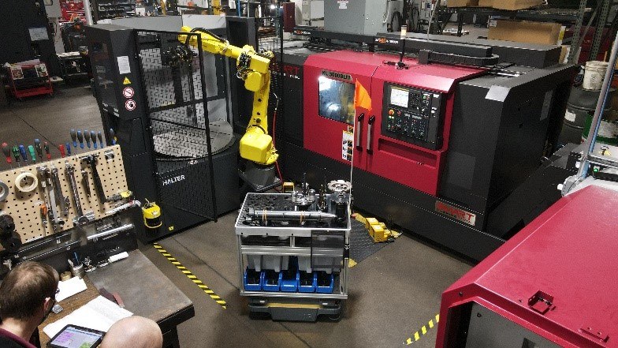
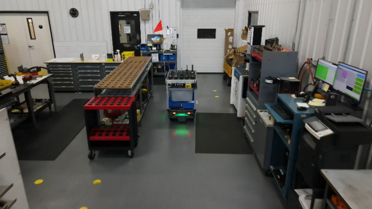
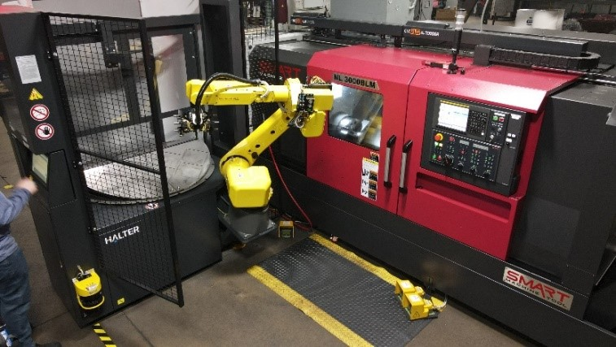

Once again, A to Z Machine is stepping up their efficiency game by adding another robot to our team.

On our Facebook page, you can find a link to an article featuring TED our first Autonomous Mobile Robot (AMR). TED stands for Tools Efficiently Delivered because he delivers tooling and gaging to our tool room. Fitted with a rack, the tooling sits on top of TED for easy travel and sorting. It is programmed to go to many areas all throughout the shop, including hard-to-reach spaces. TED collects and delivers tooling from machinists at the start and end of their jobs. TED not only increases efficiencies but also adds quality in the tool room, eliminating the need for other tool carts crowding the room. We are happy to be partnered with WMEP Manufacturing Solutions who make owning TED possible.

Seeing the success in productivity TED has brought to our shop, we have recently added one of his family members to the team. Meet TED’s cousin. Not yet named, this new addition to our family is the Halter Industrial 6 Axis Robot. This robot is a robotic arm that attaches to our CNC Machine to load and unload parts from the lathe, allowing the machine to be run unmanned. This new technology looks snazzy but also improves our machinist’s productivity on machines. Employees can now work more than one machine at a time, allowing our company to be even more effective and competitive.

Check out TED and his cousin below:

Our Autonomous Mobile Robot, TED, hard at work. Gathering tooling and casting a green light for pedestrians to look out for him as he does his thing.

TED’s cousin, Halter Industrial 6 Axis Robot, attached to our CNC Machine allowing machinists to manage more than one machine at a time.

TED and the Halter Industrial 6 Axis Robot together.
