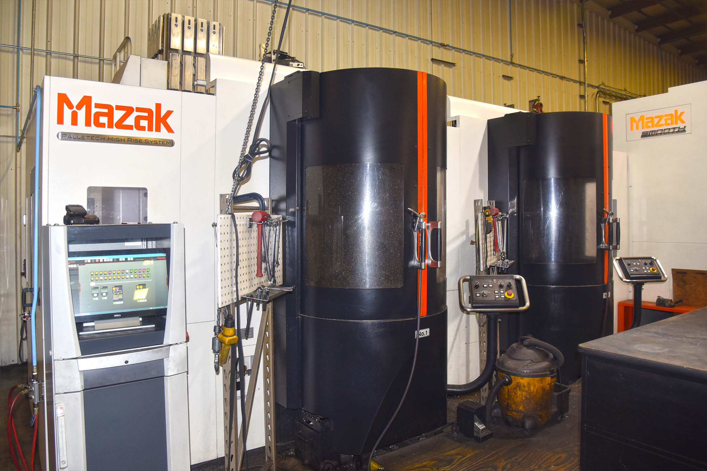

If you have read our previous blogs, you have heard about our new recent technological updates including adding two new robots to our team: an AMR robot named TED and the Halter Industrial 6 Axis Robot. This is just the start of the modern changes A to Z Machine is making. As of 2019, we have added more smart technology called Palletech made by Mazak.

Palletech is a giant machine that brings advanced automation to our CNC Horizontal Machinery. Similarly, to the robots, it allows for lights out machining capabilities. It also includes cool new features like having a touch screen to monitor machine operations while even offline. Palletech systems also feature SmoothG Control with smooth tool management, tool data informatics, and tool life monitoring.

We got our first Palletech device in 2019, named the Mazak HCN- 6800, located in our Production building. This device alone has produced the same amount of output it would take two standalone machines to do in the past. Since getting the HCN- 6800, we have added more pallets to the machine, bringing our pallet total to 28. Since then, we have added another Palletech machine to our Manufacturing building.

A to Z Machine does some work for extremely high-tech customers, having at one time, 1,000 active open jobs throughout the shop floor. Having large workpieces like Palletech allows us to do multiple operations in one set up. This adds to our machine’s dependability, speed, and reduces human error. Having our machines able to run unmanned with advanced technology, increases our efficiency.
