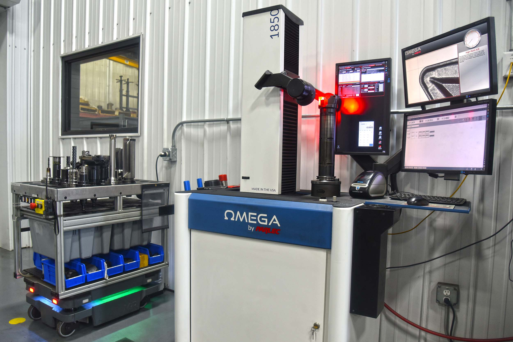
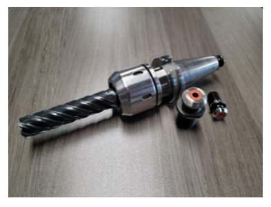

A to Z Machine uses advanced RFID and Mazak’s Smooth Tool Technology to increase efficiencies in our workplace.

RFID Technology is a hardware chip located on the cutting tool. Our shop currently has 10 machines using this technology. The RFID chip uses digital data encoded in the tag to store databases about tools. The Smart Tool Technology works with the RFID chip providing the software behind it. The Smart Tool Technology has four main facets being machine design, engineering, support, and CNC technology with smooth technology solutions. This technology transforms information needed about a tool to our machines and computers for easy access to all data.

Why do we choose to use this technology? Our main reason is the ease it gives to our machinists. They oversee operating the machine and should not have to worry about entering information about a tool, keeping track of life count, offsets, etc. This technology takes the stress away from the operators by having all needed information in one database.

This also makes it easier for our tool room staff. Unlike our competitors, A to Z Machine has an organized and highly efficient tool room featuring our tooling and gaging staff. Our tool room team helps the machinists to monitor their tool life, replacing them as needed. They do this with our tool presetter, also known as TMM. The presetter lets the staff known when a tool’s life is up, something needs to be replaced, and more. The tool presetter uses the same RFID and Smooth Tool Technology to have all information located in one place.

Using the RFID and Smooth Tool Technology is just the beginning of our technological advancements. A to Z Machine has an inside developer who developed our own organizational software. This allows machinists to easily put in tooling and gaging requests and automatically send them to the tool room. The software then schedules and tracks the requests. This eases the work for our machinists and tool room staff.

Another reason we chose to upgrade to these new technologies was to reduce human error and increase efficiencies. Since the tool data is already located in our machines, the operators do not have to manually enter data into the machine. This saves time and as mentioned, prevents human error.

At A to Z Machine, we are always looking for new innovations that will help out our staff and have the best results for our customers.

Here is a picture of our tool presetter:

Here is a picture of the RFID chip in one of our tools(the red circle):

