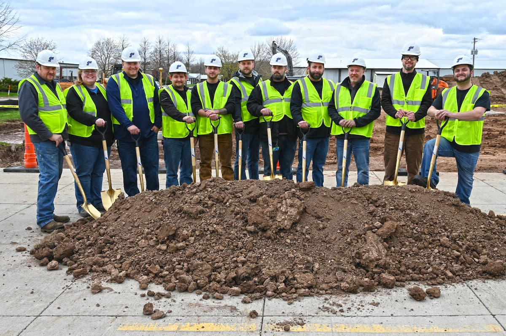

A to Z Machine Breaks Ground on 30,000-square-foot Production Facility

<em>Addition will further the company’s commitment to employee retention & the local economy</em>

A to Z Machine broke ground on a 30,000-square-foot production facility in Appleton, WI, **the first expansion as an employee-owned entity**. The new building, which is being built by Consolidated Construction, Co., will expand the company's first shift capabilities and support its continued growth.

“We see the buildout as a retention initiative,” said Amanda Schabo, chief financial officer at A to Z Machine. “We have several highly skilled machinists currently on our second shift that, in time, want to transition to first shift.  We don’t have the space to add additional machines for them in our current facilities.”

The additional manufacturing space will also push A to Z’s total to over 110,000 square feet, allowing the company to innovate and improve alongside its customers' needs. The new facility will feature state-of-the-art machinery and automation systems to enhance CNC parts capabilities for clients in a number of industries, including agriculture, military, food processing, oil and more. Construction is expected to be completed by September 2023, with the space being operational by October.

In a statement at the groundbreaking, Jason Pettitt, vice president of construction at Consolidated Construction, Co., headquartered in Appleton, WI, thanked A to Z for being a trusted partner for many years. “We’re committed to doing this the right way,” Pettitt said. “We aim to provide a quality experience to all the employee-owners.”

Dave Reiter, a former employee-owner of A to Z, shared his enthusiasm for the project, which has been a part of the company’s strategic planning initiatives for about three years. “A to Z is known to offer good jobs with great pay and benefits,” Reiter said. “This is extremely positive for workers and the community.”

Marc Manteufel, leadership team member, manufacturing engineering manager and IT manager at A to Z Machine, echoed Reiter’s words, calling the expansion “a smart move.” “This is the best company I’ve worked for,” Manteufel added. “The way employees are treated at A to Z is outstanding, and I love to see us staying relevant with technology.”

A to Z Utility Department Lead Randy Smith views the expansion as a way to help inspire the next generation of machinists, especially through the company’s youth apprentices program which gives high school juniors and seniors in the Fox Valley hands-on experience. “This new building will provide even greater opportunities for youths to explore the world of machining and consider it as a viable career path when they graduate,” Smith said.

The new facility upholds A to Z’s True North Statement to be the machining industry’s supplier and employer of choice. “We know that to thrive as a business, we must continue to grow,” Schabo said.