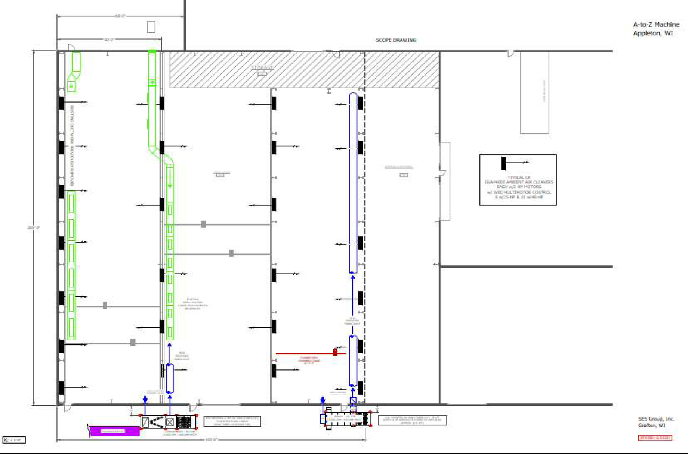

Here at A to Z Machine, we pride ourselves on caring about the wellbeing of our machines, but more importantly, the machinists. This is why we are adding an HVAC to our South Building at 2701 E Winslow.

If you are unfamiliar with our location, we have three building all located within a block of each other. One building is primarily for our office staff and production, one building is for fabrication and welding, and the other holds a large variety of machines. The big building is divided into an East, West, and South area. We are excited to be adding an HVAC and air filtration system to the South building, hopefully by the end of the summer.

HVAC stands for Heating Ventilation and Air Conditioning. This new system will not only offer much needed air conditioning to the building but has a built-in dehumidifier and air filtration system. The air filter systems filter and circulates to air in the building every 6 minutes. This new system will improve quality, keep equipment clean, preserve battery life, increase building security, and add comfort to our employee’s day. We want to show our employees that we care about their wellbeing and want them to be comfortable and looking forward to coming into work every day. We are hoping that potential new employees and hires will see our commitment to caring about our #greatpeople.

This process has been a long time coming. Starting last year after budget approvals, A to Z Machine’s head of maintenance has been researching HVAC systems and vendors. The process has been narrowed down to 2 companies: Hastings Air Energy Control (known for air filtration) and SES Group (known for heating and cooling). These two companies have been working together to create an effective HVAC system for our space.

We have applied for “Focus on Energy” rebates for this project. A project of this size has 4 levels of approval. At this time, we are waiting on the 4th and final approval. After receiving this, we will move on to preparing our shop for the HVAC system. We will create platforms outside for the systems to sit on, hang air filters, hire electricians to wire and get them running, get the AC’s in via a crane, do final wiring and ducting, then it will be installed.

We are hoping this is just the start of our HVAC systems and that we can grow into more buildings in the future.

Here is a preview of our ventilation layout:

