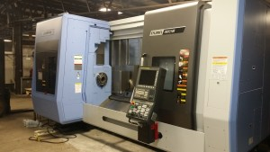

Our new Doosan-Puma SMX3100 has arrived and is ready to go! This is a High Performance 5-Axis Turning Lathe with a 40 HP Main Spindle and 35 Milling HP.

Capacities on the machine are 4” Thru Spindle, 26” Maximum Turning Diameter and 60” between centers.

We are excited to add additional multi-tasking capabilities to our shop.

Want to learn more about what we can do? Click on the “Capabilities” link at the top of our page.
