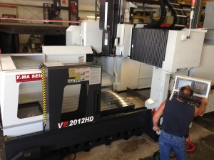

This week our new Awea Vertical Machining Center will be up and running.

Capacities on the machine are 48” Y axis, 80” X axis and 30” under the spindle. This Awea VP-2012HD is 30 HP with a 10,000 pound table load capacity.

We are excited to add this to our variety of resources will and it will be fully up and running by the end of the week!

Check out our capabilities by clicking on the “Capabilities” link at the top of our page.
