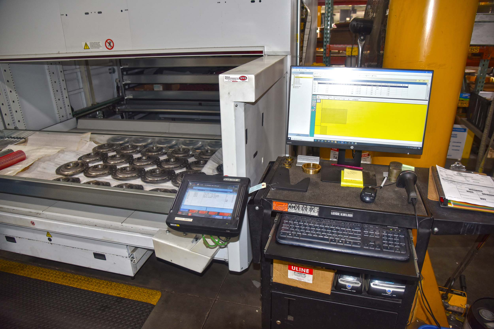
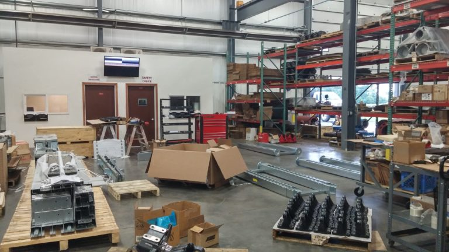
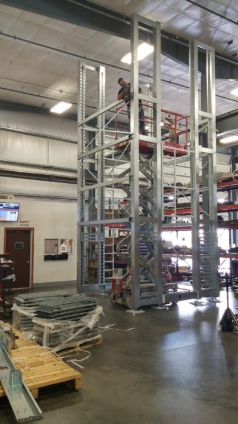
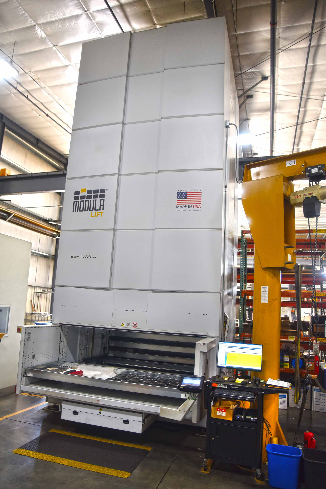

Our Shipping & Receiving department has recently completed the installation of a vertical lift system which uses trays on a storage carousel to more efficiently house finished parts that will be shipped to our customers.

The Modula Vertical Lift Module will allow us to improve work-flow, increase productivity and better control inventory management. Vertical storage will not only increase shop space, but will increase our efficiency in locating materials as well.

We are excited about this new, time saving addition and the ability to better serve our customers.

[Learn more about what we can do](/capabilities/).

Unpacking the Modula

Assembling the Modula

Assembly Complete
