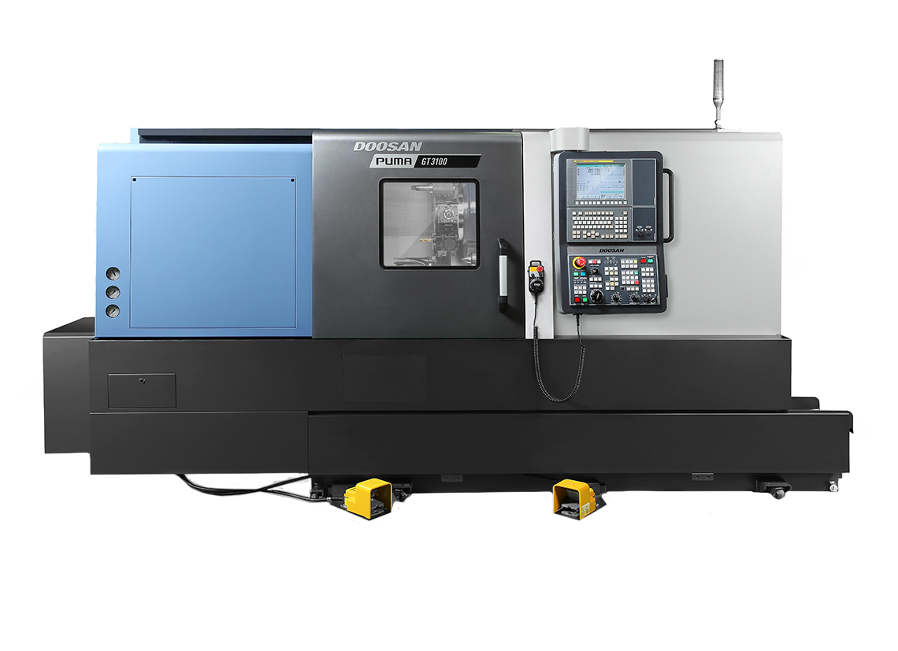
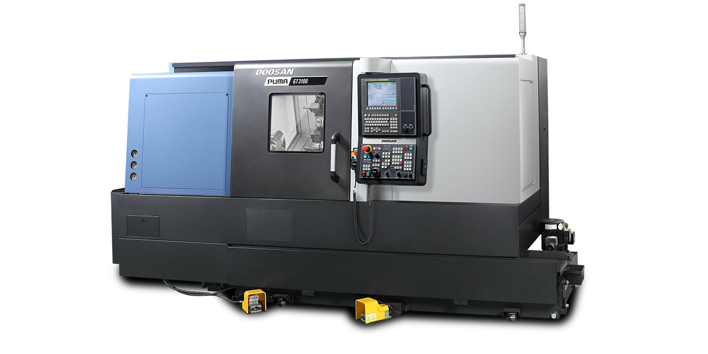

At the end of December, A to Z Machine purchased two new Doosan lathes to replace the older machinery. We ordered a Doosan Puma GT3100 and a Doosan Puma GT3100L. One of the lathes will be arriving in January and the other in March.

These lathes come with new and improved technology that increases our machining capabilities. Not only are they more powerful and come equipped with a 15” chuck, but they also have a larger capacity than the lathes they are replacing. Both new machines will feature Fanuc’s new Oi-Plus Control with a 15” iHMi touch screen. Additional specifications include a 28.3” swing, an 18.9” maximum turning diameter, a 29.7” and 50.2” maximum turning length respectively, a 4” bar capacity, 47 Horsepower spindle with 2800 RPM, and an 1190 ft-lbs of spindle torque.

A to Z Machine places a great emphasis on having the newest innovations and machinery incorporated within our shop. This emphasis improves overall quality and efficiency, along with saving lead time for our customers. It is important that we replace the lathes now to maintain our equipment, so it is more dependable, easier to use, and more enjoyable for machinists to run them. This is why we have invested our time and money to acquire a nicer, newer, more functional machine or in this case, two.

