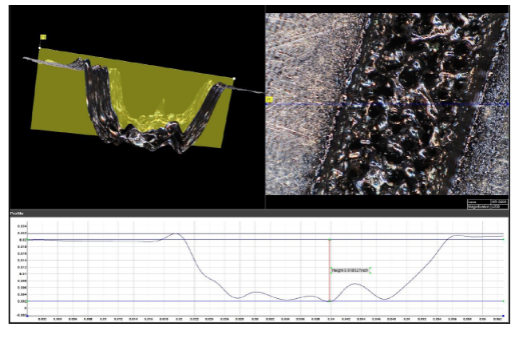

A to Z Machine is constantly looking to add new processes that will increase our efficiencies, add to our capabilities, and widen the industries we serve. That is why last week we chose to purchase a deep laser engraver.

Right now, as many machine shops do, we use Dot Peen and Metal Stamping to engrave the part number into our parts. While this has worked fine for us in the past, buying and using a laser engraver will be more efficient for us to use.

To ensure investing in a laser engraver was the right choice, we went through a testing phase with 2 different vendors. We sent samples to them, and they used their lasers to test its abilities. One vendor had its own lab and measured the width of depth of the engraver, also making sure we can still read the part number after the part is painted. The other vendor used an independent lab to make sure the engraver did not weaken the metal or quality of the part. We were very happy with the results and with their consideration, decided to move forward in the buying process.

The laser engraver is set to deliver in about 6 weeks. Before it arrives A to Z Machine will work on making fixtures to hold the tools as well as creating a cart to hold a computer, the laser engraver, and a fume extractor.

We decided to order a fume extractor along with the laser engraver to keep our employees safe. The fume extractor will take the fumes produced by the laser engraver, filter it, and pump clean air out. Our most important consideration is to make sure our team members are safe.

A to Z Machine is very excited to add this as a new capability and hopefully broaden our customer reach from here.

Here is a picture of the Electron Microscope Lab results:

Laser Engraver:


Fume Extractor:

