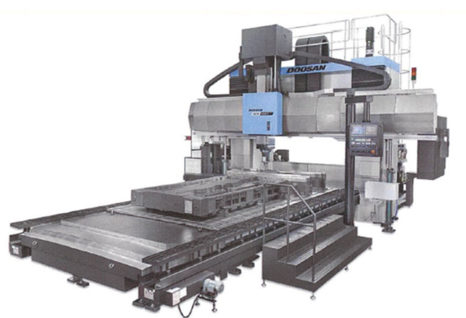

Yet again, A to Z Machine is stepping up its innovating game by purchasing a new machine: The Double Column Bridge Mill. The official name is the Doosan DCM-2740F II.

The Double Column Bridge Mill is a large vertical machining system with 5 face capabilities. It is used for applications such as large and complex parts and high precisions dies and molds. Some options for the machine that we purchased include: the Extended Z axis travel, Extended W axis travel, Extended column, Semi- guarding, 90 Tool ATC, 3 Position AAC, and a high torque spindle.

This heavy-duty machine has 3 spindle attachments: a vertical spindle, right angle head spindle, and universal head spindle. The vertical spindle is a spindle already offered on our other Large Mill Machines, but this feature will help increase our capacity, decreasing the time it takes to fulfill an order. It also is much taller than our previous vertical spindle and almost reaches to the height of our ceiling. The right-angle head will increase efficiencies, combining operations from multiple machines into one. The universal head spindle is what we are most excited about. This spindle is capable of 3 + 2 machining and can index at every degree including compound angles. This is a new capability previously unoffered by A to Z Machine.

This machine is one of the biggest A to Z Machine has ever purchased. It weighs in at about 144,000 pounds. The machine itself is 37 feet long by 26 feet wide and 22.5 feet tall. The travel size is 167 inches on the x-axis and 126 inches on the y-axis. The distance from the table on the machine to the vertical spindle is 92.5 inches. This machine is so big that we will be sinking it down into the ground so it will be easier for our machinists to use it. The machine’s table will be at floor level.

This high-profile Doosan machine is very rare in Wisconsin and the Midwest. Our competitors do not have this machine and the capabilities it holds. We chose to make this big purchase to expand the industries we can serve and meet customer needs. As mentioned above, it will also increase our quality, abilities, time management, multitasking capabilities, and capacity. A to Z Machine placed the order for the machine last week. It will arrive sometime at the end of the year and be up and running for our customers use by early March.

Stay tuned for a blog about another machine ordered: A new generation Mazak Horizontal Mill.

Here is a generic picture of the Double Bridge Column Mill. Ours will feature additional semi-guarding:

