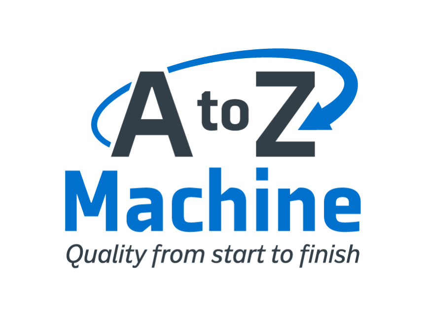

Big news! Today, after almost twenty-five years, we’re releasing an updated brand identity, which includes a new logo, colors, and font. You’ll start seeing the new look on our buildings, vehicles, website, and social media channels over the next few weeks/months.

This is a big change for us as we have had the same brand since our origination in 1996. Since then, we have become 100% Employee Owned and have grown from a small 5-machine operation to over 130,000 square foot operation with 150 employees, over 70 machines, and the latest in technology. Our new logo defines our strong machining capabilities, innovative thinking, and evolution in our industry.

The goal of our new design was to better match how we look to our values and the users we serve. A small internal team and a great team of experts at Insight Creative, Inc worked to find something that appeared sharp, innovative, and trustworthy – as that is how we define A to Z Machine.

The gray-blue combination evokes feelings of depth, precision, stability, and professionalism – again, how we define A to Z Machine.

We looked at our former tagline “Quality from start to finish” and decided to bring it back. Our customers have trusted us with their machining needs for decades and know that they will receive the highest quality from our phenomenal machinists.

We are excited for our new look, and we hope that you like it as well. Stay tuned for more updates and a brand-new website as we continue to try to better serve our users with clean, modern, user-friendly technology.
