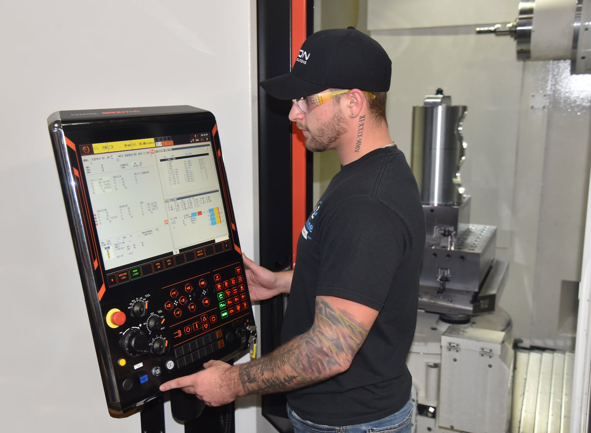

Almost every industry—from aerospace to agriculture—needs precision components or assemblies for their equipment. And A to Z Machine’s team is skilled at completing those complex, precision projects, whether customers need just one special part or thousands. 

In this month’s blog, Al Melby, Manufacturing Process Manager at A to Z, talks about precision machining and how customers know they’re choosing a shop that has the capability to meet their needs. “It starts with equipment, but it’s more than that—it’s also about quality, skill and the support team that’s in place,” Al said. “We have systems in place to ensure we’re going to be able to meet or exceed a customer’s needs. That’s what A to Z is all about.”

## What questions should a customer ask when choosing a precision machine shop? 

“I think one of the first things that customers should ask is about a shop’s manufacturing capabilities,” Al said. “And they should know whether you’re embracing the equipment and technology that supports their needs.” 

A shop should have robust quality systems in place that will make sure that the parts meet a customer’s specifications. “What are your supporting resources—do you have an experienced sales team on hand?” Al said. “What does your quality team and their resources look like? What kind of manufacturing and engineering resources are in house? Those are the kind of questions they should be asking.” 

Customers also will want to ask about lead time and understand the volume of work the shop does, Al said. 

They also should ask whether the shop has equipment with multiple axis machining capabilities, like A to Z does — that means instead of moving the part between multiple machines, the shop can machine more of the features on a part on just one machine, improving precision.  

“We invest in not only good equipment but also in the best tooling we can get—and that will create the most efficient machining processes,” Al said. Coupled with that, A to Z has some of the most talented machinists in the area and is investing in a robust training program that will be able to sustain the talent for years to come. 

## Why customers should choose A to Z Machine as their precision machine shop 

One of the great things about working with A to Z is the shop provides a one-on-one contact point — a customer manager—who will “be the face of A to Z for that customer,” Al said. “They are the first-line point of contact. They’ll look at the blueprint or a model to decide if it’s a project that fits A to Z, and to ensure that we can meet or exceed the customer’s expectations.” 

The customer manager also will work with scheduling and manufacturing teams and will help develop the manufacturing process for that part. 

A to Z also invests in its people, having strong training programs in place for its machinists to build skills from within. 

“The thing that separates A to Z from many shops is our [True North philosophy](/true-north/)—to be the machining industry supplier and employer of choice,” Al said. “It’s important to us to have good partnerships with our customers, and we want to provide quality from start to finish.” 

## Interested in joining our team of machinists?    

Join our employee-owned company and become a part of this dynamic team.

<a class="btn btn--primary" href="/careers/">Apply now!</a>
