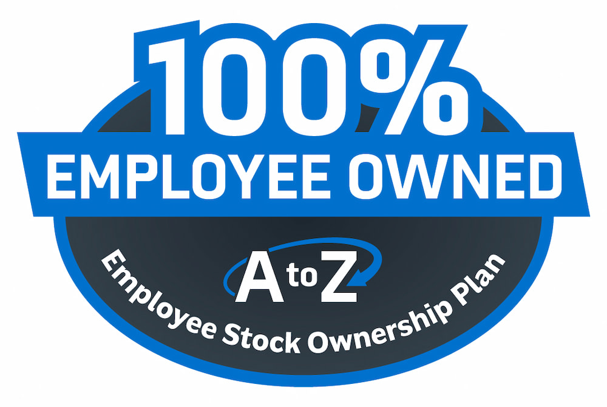

A to Z Machine Company was founded by a group of co-workers in 1996 who built the small four-person shop to become one of the largest precision machine shops in the Fox Valley region of Wisconsin. When it came time for those founders to retire, they wanted to develop a plan that best fit their company. 

“They could have sold to a private equity firm or to a competitor,” says Don DeWitt, A to Z Machine’s President. “But those options weren’t as advantageous for their employee partners who had played a very big role in the success of the company.” 

In this month’s blog, Don talks about why the owners chose to develop an employee stock ownership program (ESOP) and why it was the best option for A to Z and its team. 

## How the employee ownership program works for A to Z and its team 

The ESOP offers an opportunity for current and future employees of A to Z to earn significant rewards over time. “The longer you’re here, the more shares you accumulate and the higher your account balance gets,” Don says. “The ESOP really takes the form of a secondary retirement account, and the process is similar to a 401(k). At the time of retirement, or when you decide to leave the company, you can trade in those shares for the value.” 

That value increases the employee’s retirement fund and, in many cases, allows employees to retire earlier or have more funds available during retirement, Don says. “For those people who have been here for the last five years, they have significant value in their funds at this point.”  

So, on top of the company offering a competitive hourly wage, health insurance benefits, a 401(k) and bonus program, the ESOP is an added benefit. “It’s like a bonus on top of a bonus,” Don says. 

## Why customers appreciate A to Z Machine’s employee ownership program 

Customers of A to Z Machine understand that the ownership structure is an indicator of the long-term stability of the company. “Because ESOP regulations require certain structural policies and resources to be in place, you’ve really got a strong professionally run organization, which hopefully contributes to its sustainability,” Don says. 

Within the ESOP, there’s a trustee, board of directors, management team and strong people throughout the organization, Don says. “If something is happening to any one of us, it may not have as big of an impact as if there was one individual owner of the company,” he says. “I believe we’ve reduced risk by being an ESOP, and we also improve the attractiveness of the company to attract top-end talent.” 

## Why an employee ownership program benefits new workers  

“As an owner/shareholder within the company, the work you’re doing is more impactful and more meaningful because it’s of greater benefit to you in the long run,” Don says. “Not only are you receiving wages, benefits and other traditional benefits, but you’re also receiving stock within the company.”  

The benefits of working here versus for a privately owned company means that you’d be a part-owner, and you would benefit from the profits the company earns, Don says. “I think it’s just more meaningful and more beneficial to work here than for other companies.” 

## Interested in joining A to Z?    

Join our employee-owned company and become a part of A to Z’s precision team.

<a class="btn btn-primary" href="/careers/">Apply now!</a>
