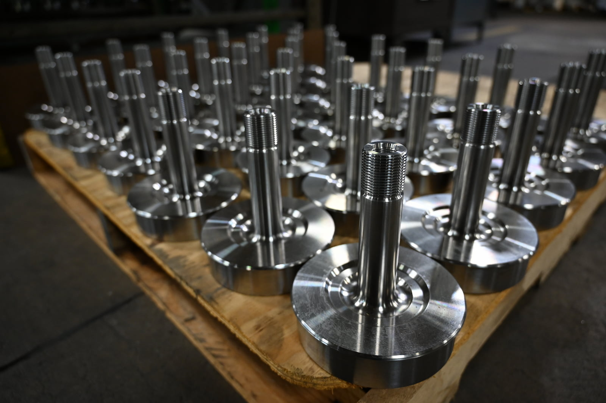

   

As one of the largest precision machine shops in Northeast Wisconsin, A to Z Machine works with customers from many industries and is always ready to answer any questions about their CNC machining capabilities. 

And while some companies have a list of Frequently Asked Questions, “we don’t really get those because we get more project-specific questions,” says Marty Deike, Senior Customer Manager. “A lot of times, our customers want to discuss lead times or cost-saving measures, and we can help address those questions.” 

In this month’s blog, Marty talks about how his team responds to questions and walks customers through their options when it comes to ordering precision parts.    

## What customers often want to know 

If a customer asks about cost-saving measures for their project, “the customer manager will work with them hand-in-hand on design for manufacturability and process improvements and other factors,” Marty says. 

Another common question is about lead time, which can change quickly depending on the circumstances, complexity of the part and size of the order. 

“It boils down to the actual design of the component that’s at hand, so it truly is part-specific in a lot of cases,” Marty says. Additionally, A to Z Machine will carefully look at each design to ensure they’re feasible. 

Other factors that affect the cost might include whether a part needs to be expedited and what types of finishes are required, he says. 

“There are some ways we can work on cost savings for our customers, whether it’s design features or relaxing tolerances when they aren’t necessary,” Marty says. “It depends on the customer’s final design, how it works in their end assembly, and what we think will be acceptable.” 

## Communicating while working with complex orders 

A to Z Machine CNC experts work with the gamut of projects for their clients, including large assemblies. 
 
“Obviously, the larger the component or assembly, the more questions our customers have or the more features we look into for pre-planning purposes and on-time delivery,” Marty says. “And, of course, the larger the project, the more quality you have to be concerned about as well because everything has to mesh together.” 

Some industries can be more complex than others. “There’s definitely more complicated components and more stringent requirements that we have to adhere to when it comes to industries like aerospace or specialized testing companies, so there’s definitely a lot more communication going on,” Marty says. 

## Keeping in touch with partners 

When it comes to working with their suppliers, A to Z stays in touch to help ensure they can respond to customers’ questions about delivery times and availability. 

“We have excellent suppliers, and the nice thing about having these close bonds with our suppliers is that we have the ability to expedite projects,” Marty says. “It’s all about building good, strong relationships with both your customers and your suppliers. We work to build each other up so we can all be successful.” 

## Why A to Z Machine’s customer managers are good at helping clients 

The customer managers at A to Z are very well-versed in the company’s CNC Machining capabilities and can answer their customers’ questions because most of them have many years of experience working on the floor. 

“Occasionally, we will need to go and talk with some of our machinists if we have a request for a complicated part, and we want to make sure customers feel confident they can achieve the tolerances or work with the design,” Marty says. 

Marty himself started off as a toolmaker apprentice and worked his way up in the industry. “I’ve got a real love for the manufacturing world, as do our other customer managers,” he says. “For us, it’s about building that strong relationship with our customers. That’s the most important thing about operating a business—having faith in each other and knowing that no matter what, you’re doing the absolute best you possibly can to make things work for them.” 

## Interested in joining A to Z?     

Join our employee-owned company and become a part of A to Z’s precision team.

<a class="btn btn-primary" href="/careers/">Apply now!</a>
