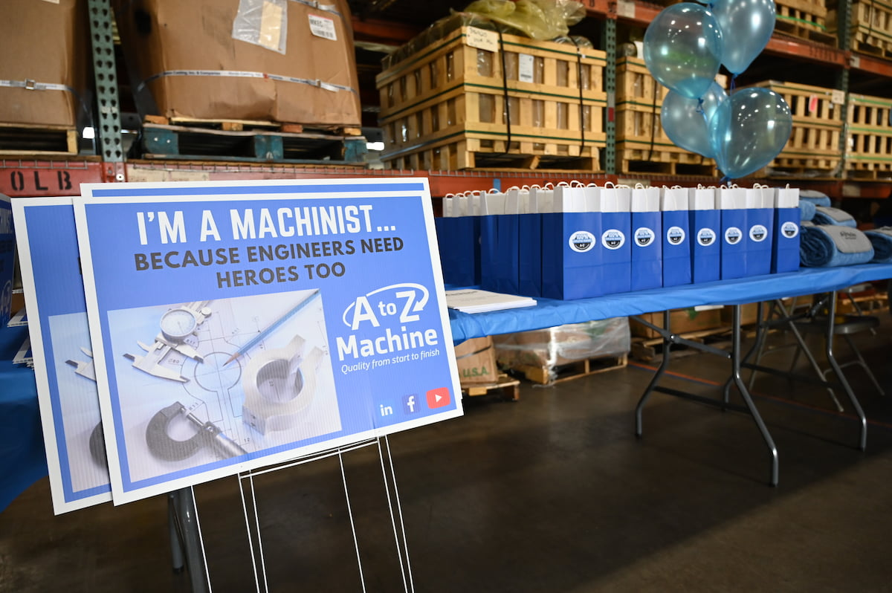

One way that A to Z Machine helps attract young workers and retain employees long-term is by focusing on building its company culture.  

“Obviously, every company wants a positive culture—but I think that A to Z being a smaller company, everyone is able to truly know and connect with each other on a personal level,” said Sydney Wilcox, A to Z Talent Acquisition Specialist. “That’s something special for us.” 

In this month’s blog, Sydney discusses the ways A to Z Machine builds its company culture and why that’s important. 

## A to Z operates by a True North philosophy 

A to Z Machine has built its culture around its True North philosophy, starting with its purpose to be the machining industry’s supplier and employer of choice. The company has built its daily operations around an extensive list of guiding principles, including a focus on growth and development, providing stability, and creating a safe, creative and respectful environment for everyone.  

It also focuses on benefits like its employee stock ownership program (ESOP), which allows employees to earn shares in the company.  

“The fact that we are employee-owned means the culture is a direct reflection on us as a whole,” Sydney said. “We all take part in it. Culture drives results, and results drive how well we do in our ESOP shares. We have a responsibility to take care of our company, and culture is a huge part of that.” 

## A to Z cares about training its team 
 
With a significant number of employees who have more than 20 years of tenure, there are plenty of people around to share their experience whenever someone new is hired at A to Z Machine 

“We don’t even have to tell our team to take the new person under their wing,” Sydney said. “When you hire good people, those good people are going to naturally want to help everyone they can.”  

A to Z Machine also hosts a robust youth apprenticeship (YA) program, offers professional development opportunities and gives team members the chance to further their education.  

“A to Z has no problem with investing in their people,” Sydney said. “It’s not even a second thought if someone wants more opportunities for training—we’re very good about supporting that. At a small company, you don’t always get that, so I think that’s pretty awesome.” 

## A to Z hosts company gatherings 



A to Z Machine always takes an opportunity to show appreciation for its team, including through hosting fun activities that help build a sense of camaraderie.  

For example, the company caters meals to celebrate anniversaries, hosts cookouts and regularly reaches out to team members individually. “Recently, we handed out little bags of Chex mix with a note that said ‘Just ‘chexing’ in to make sure you know you’re appreciated,’” Sydney said.  

It’s a way for the company to speak to everyone personally and ensure they know their value to the company. “In my opinion, it doesn’t have to be big and crazy—we do what we can with what we have, and I think those actions go a long way to make people know they’re valued.” 

This past spring, A to Z also hosted a company-wide picnic in Appleton and an open house to which family members were invited. 

“We brought in a dunk tank and food, and everyone and their families were welcome to come through and look at the machines and get to know people,” Sydney said. “It was wonderful watching people and seeing how much pride they take in their jobs.” 

The event included games, prizes, photographs and a dunk tank. “Even the president of our company sat on the dunk tank, and I think that our culture shows that no one’s above anyone here. We’re employee-owned, we’re all one big team, and that’s really cool.” 

The company plans to make the picnic an annual event. 

## A to Z has a flexible work environment 

“One thing I’ve noticed with our culture here is we are very, very flexible and very family friendly,” Sydney said. Some team members might come in and start work a little bit early so they can leave later in the morning to walk a child to school. Others might need to leave for a last-minute doctor’s appointment for themselves or a family member. 

“You can’t do that at every company, but things like that are never an issue for us,” Sydney said. “It’s a small company, so not only are we like a family, but our people’s families are like our family, too. And you take care of family first. That’s how we look at it. 

## A to Z pays attention to what candidates want 

Within the interview process, Sydney often asks candidates what they want in a company they work for. “Almost all of them say, ‘I just want to feel like I belong,’” Sydney said. “’I want to come to work every day not dreading it or the people I work with.’ It’s always been important, but in this next generation, I think it’s even more important than ever. They’re not going to put up with being unhappy.” 

Sydney said one of the biggest benefits of being a smaller company like A to Z is the ability for everyone to really get to know each other, understand each other and build a lot of connections. “I think we do that really well,” she said. “Not only does that make the culture better because you enjoy who you work with, but it also just makes everyone work better together. I think that our team being super close-knit is an advantage in so many ways.” 

## Interested in working with A to Z?      

Learn more about our company and how A to Z’s team works together on precision parts every day. 

<a class="btn btn--primary" href="/contact/">Contact Us Today!</a>