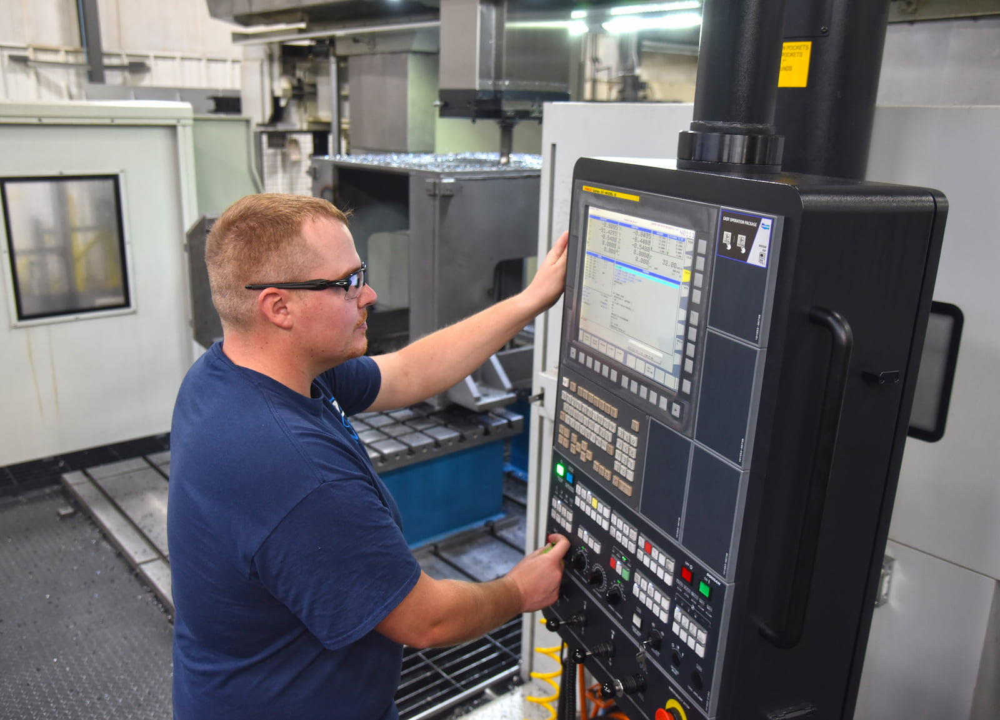

Machinists at A to Z Machine in Appleton, Wisconsin, work each day on complex, precision projects for clients in a variety of industries. Some work is completed on a “job shop” basis and other projects are completed as “production” jobs.

“All the work we do here is very technical in nature, but some is more repetitive and doesn’t require machine tear-downs and re-setups, which is why we call that ‘production,’” said Amanda Schabo, Chief Financial Officer at A to Z.
 
In this month’s blog, Amanda talks about how projects are directed to the production side or the job shop side, and what it takes to successfully complete projects in either area. 
 
## What’s the difference between “job shop” and “production” type work?

“The philosophy behind production-type work is something that repeats frequently for us,” Amanda said. For the job shop side, “you are re-setting up the machine in between jobs to be able to run the next job.” 

Production involves running a higher volume, whereas job shop projects mean a smaller volume but a higher mix of projects. And a job shop project may even include an order for a single part.

To make the parts, machinists either will work with a piece of raw material or they will perfect a part that has been casted or forged by a foundry, Amanda said.

“We do a lot of that on the production side,” she said. “On the job shop side, sometimes we’re taking a block of steel, then milling and turning it into the part.”

In either the job shop or the production area, all work is completed through A to Z’s [CNC machining services](/capabilities/cnc-machining/). On the job shop side, however, there is a greater variety and size of the type of machines used.

Work is fairly evenly divided between both sides. When A to Z started in 1996, it produced mainly job shop type work, but the company has seen a shift to where sales volume is now about half-and-half, Amanda said.

## What kinds of industries do you serve?

A to Z “makes parts that go into machines that make things,” Amanda said. When someone buys a bottle of soda, for example, they don’t often consider what kind of machine made the bottle—but that’s the type of equipment that A to Z makes parts for, as one example. 

A to Z works with a wide range of industries primarily on the job shop side, including food production, agriculture, scientific research, oil and gas, marine, wind and energy and many more.

“When we look at the industries we serve, it’s primarily job shop work, except for the military industry,” Amanda said. “The military projects are more of what we see on the production side.”

A to Z is adding to its facilities and is open to adding production work that targets other industries.

## What skill sets are needed for each type of work?
 
Where a machinist will work — job shop or production — depends on their skill sets.

“Normally in the production side, it’s somebody who wants to get started in machining,” Amanda said. A newer machinists may have a few machine setups in this area and be able to learn how to do that well. 

Our production machinists play a critical role within our company. “The work is considered a high volume for our industry and is highly technical in nature,” she said.

Within the job shop, machinists will typically start on a smaller machine and work their way up, Amanda said.

“The job shop is very technical, and the complexity rises as the machine increases in size,” she said. “Even some of the smaller machines run very complex parts.”

Some parts require a very tight tolerance — “you’re talking about a hair on your head, maybe finer than a hair on your head” — so the machining is very precise.
 
## What types of workers are you looking for to join your job shop or production teams? 
 
“A good machinist is somebody who’s really inquisitive,” Amanda said. “They want to know why something works the way it does, and they’re interested in figuring out the process of making a part.”

That might be someone who is mechanical and has an engineering mindset. A to Z is looking for both experienced and new machinists, she said. The company has established “A to Z University” to help grow new machinists — those who exhibit that quality of curiosity are encouraged to apply.

“We will work with them, train them and build them into machinists,” Amanda said. “We are also looking for those experienced machinists that can help us run our more complex parts.”

It can take years to build a senior machinist who can work on the more complex projects completed at A to Z, so the company is committed to growing that talent.

“A to Z Machine is unique not only in the mix of industries we serve, but also in our business dynamic,” Amanda said. “Profits are important, but our people are more important. We want people to build a successful career with us. And being an employee-owned company, why not choose to work hard for yourself?”

## Interested in joining our team of machinists?  
 
Join our employee-owned company and become a part of this dynamic team. Currently, our job shop and production shops are running across two shifts.

<a class="btn btn--primary" href="/careers/">Apply now!</a>