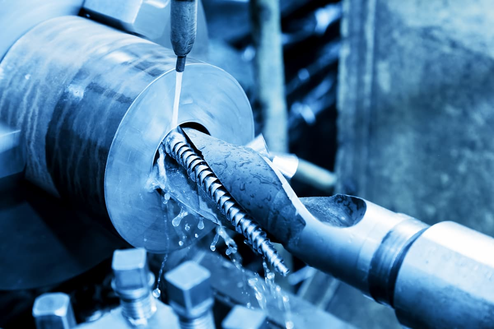

What’s in an acronym? Well, if it stands for “International Traffic in Arms Regulations”, it could be the difference between our company being hired by the Department of Defense or having them go to a competing manufacturer.

In this month’s A to Z Machine blog, quality assurance specialist **Tarta McComber** shares what our Appleton-based machine shop’s certifications and registrations mean and why they’re so important.

## A to Z Machine's Certifications & Registrations

According to Tarta, not only do A to Z’s registrations and certifications set us apart from comparable manufacturers, they also lower the risk of non-conforming (AKA scrap) parts.

“These credentials demonstrate how we **adhere to industry standards** and best practices,” Tarta said. “With them, we avoid deviating from our customer’s blueprints and manufacture the highest quality parts.”

A to Z Machine currently holds the following certifications and registrations:

* **ITAR (International Traffic in Arms Regulations).** A Department of Defense (DOD) regulation to ensure national security and that proprietary information isn’t released into the wrong hands. Visitors are required to sign in and out of A to Z facilities and certify that they are U.S. Citizens.
* **ISO (International Organization of Standardization) 9001.** A standard that lists requirements for a quality management system. A to Z is audited by an outside registrar and also performs internal audits of processes and procedures annually. This ensures robust processes to make quality parts on time, every time.
* **SolidWorks Certified Professional – Mechanical Design.** A 3D Solid Modelling software used to program CNC machines and run simulations of designs and concepts. The tool is utilized companywide, from sales and engineering to machinists and the quality team.
* **Working to be NIST (National Institute of Standards and Technology) 800-171A Compliant.** Manages Controlled Unclassified Information (CUI) which can be sensitive government information that A to Z needs to protect and keep secure. A checklist of criteria must be met.
* **Working toward CMMC (Cybersecurity Maturity Model Certification).** Another DOD/government requirement. Assessments need to be conducted by a third party.

## The Benefits of Certifications & Registrations for Customers

Credentials such as the ones held by A to Z provide customers with peace of mind knowing they’re partnering with a certified and registered manufacturing company.

“Our customers know we have internal processes and procedures that ensure they receive quality products and parts,” Tarta said. “We have **quality standards to uphold** that lead to **continuous improvement efforts**. This also leads to competitive costs for our services—some of our certifications push us to have more robust work instructions, which pushes us to make quality parts at a competitive rate.”

With such a large emphasis on quality, A to Z is always striving to be on the cutting edge of technology. Tarta concluded, “At the end of the day, these credentials keep us competitive and **keep our company strong**.

## Ready to partner with a top-tier manufacturer?

Our employee-owned company is ready to help! We proudly manufacture industry-specific goods with the highest quality and efficiency.

<a class="btn btn-primary" href="/contact/">Contact us today!</a>