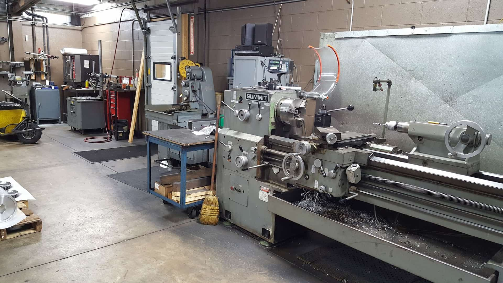

As technology advances at an exponential rate, several industries have witnessed significant change. Machining is one of those industries that has evolved tremendously over the years. In this month’s blog post, A to Z Machine Technical Lead **Fred Alexandroni** shares his knowledge of the past, present and future of machining, highlighting the remarkable progress made and the promising opportunities ahead.

## What was machining like in the past?

In the past, machining was a labor-intensive process relying on manual techniques. Skilled craftsmen meticulously operated lathes, mills and drills to shape raw materials into precise components. 

Fred recalls an old **Cincinnati Gilbert boring bar** used by A to Z “back in the good old days.” He shared: “The boring bar was totally manual and cumbersome to operate.” Spindle speeds were changed by hand and reached a max 700 rpm (revolutions per minute)—quite a contrast from the 3,000 to 10,000 rpm that can be reached in our shop today.

## CNC transforms machining in the present

The development of computer numerical control (CNC) in the late 1940s and early 1950s revolutionized machining in the present era. The first prototype of a numerically controlled machine tool was created by John T. Parsons and Frank L. Stulen in 1949 at the Massachusetts Institute of Technology (MIT). Their work laid the foundation for the development of modern CNC technology.

A to Z Machine did have a couple of small CNC (computer numerical control) mills when we first opened in 1996. Within the first two years of business, we purchased a larger Mazak vertical mill and a Toshiba boring bar to meet our customers’ needs.

Today, a programmer uses CAD (computer-aided design) software to set up programs so machinists are ready to go. “They can simply take their program, load it into the machine and start running rather than needing to do any programming themselves,” Fred said. **“What may have taken a day to run one part can usually be completed in half the time or less.”**

In addition to being more efficient, machines are safer with more guarding to protect workers.

* More: [Top Reasons to Work in Machining](/blog/work-in-machining/)

## A to Z’s evolution through the years

Our company was founded in **1996** with seven guys in the shop. “We would crank up the radio and make parts,” Fred said.

We’ve grown tremendously since then and needed to change our employee operations and invest in tooling and machinery to create a good environment. Presently, our three facilities have a combined total of over 77,000 square feet of manufacturing space with over 60 different machining centers of varying capabilities. We have more than **130 employee-owners** spread across two shifts.

We even changed our logo and branding to be more visible online. “The whole company was involved with the rebrand and was able to share opinions on how the logo should look,” Fred said.

## What does the future of machining hold?

The future of machining holds exciting prospects. “We’re getting a newer customer base,” Fred shared. “We do a lot of work for large-scale hydraulics involving pistons, weldments and cylinders. Our customer needs drive us to invest in the latest tooling and machinery.”

And—we’re growing! In early 2023, [we broke ground on a 30,000-square-foot production facility](/blog/a-to-z-breaks-ground-on-30000-sq-ft-production-facility/) to expand our first-shift capabilities and free up space in our main shop.

As for the industry, a focus on automation, artificial intelligence and data connectivity is set to transform the manufacturing landscape even further. Advancements in materials science and nanotechnology will open doors to more durable, lightweight and versatile components. A to Z continues to invest in systems that can safely run parts nonstop to reduce downtime.

“Another thing that drives change for us is engineering,” Fred said. “When engineers make a technically complicated blueprint, we’re tasked to **find a way to get things done, no matter what**. And we do.”

## Looking to partner with a leading CNC machine shop?

With our state-of-the-art CNC equipment and [highly skilled team](/careers/), A to Z Machine is equipped to handle diverse machining requirements. Whether you need prototypes, custom parts or large-scale production and weldments, we have the expertise and resources to meet your expectations.

<a class="btn btn--primary" href="/contact/">Contact us today!</a>