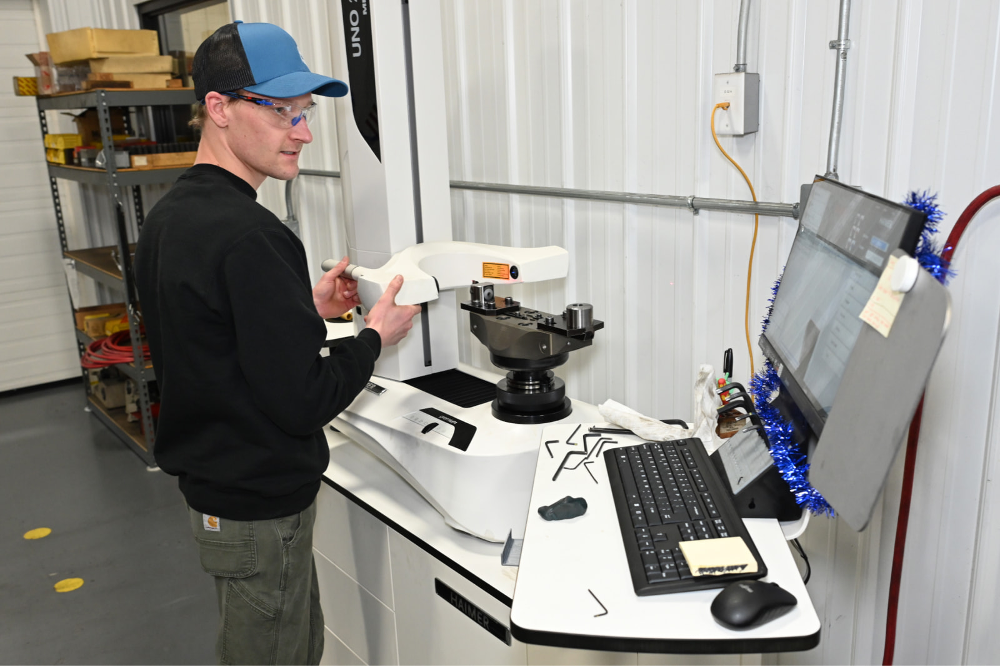
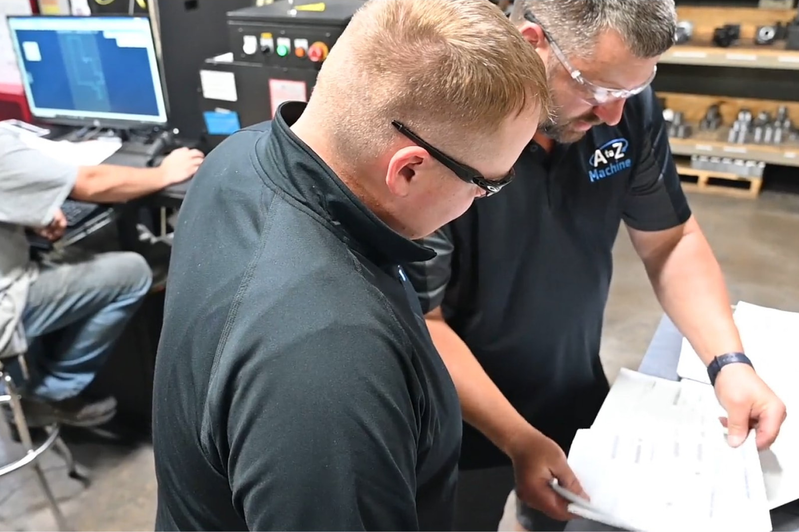
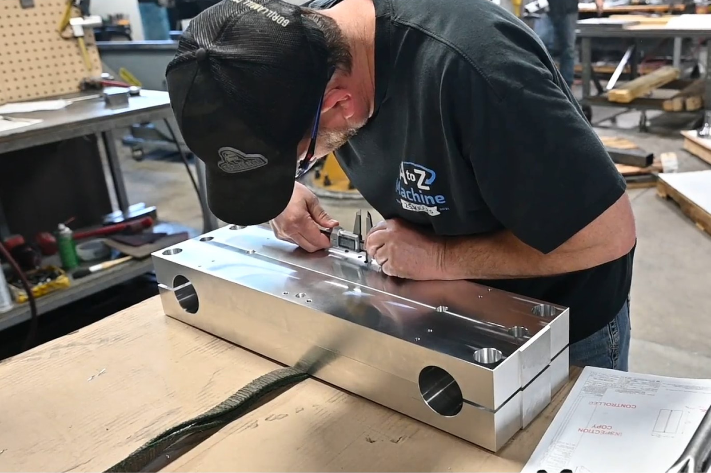

One of A to Z Machine’s core missions is to be the machining industry’s supplier of choice. That means ensuring that the value A to Z brings to its customers goes above and beyond, said **Doug Vannieuwenhoven**, A to Z’s Customer Service Manager.  

“Our goal is to be more than a supplier of parts—we want to be the problem-solver for our customers,” Doug said. “Then, our customers will see us as a partner.” 

In this month’s blog, Doug shares the ways A to Z Machine sets itself apart as more than simply a supplier of quality parts. 

## How A to Z solves problems for its customers 

“We’re always striving for customer satisfaction, and that means making a quality part in a timely way,” Doug said. “But it’s more than that. It’s offering a one-stop shop for our customers.” 

That means starting each project with a team approach. “For many projects, we’ll go out to the company, sit down with engineers and go over a product with them,” Doug said. “We’ll talk with them about design and other considerations right from the beginning.”  

Customers seek A to Z’s input to understand ways to improve the product design for manufacturability, cost-effectiveness, or efficiency.  

“We’ll have multiple departments and scheduling all in on the preliminary sit-down meeting to go over the project, put together a plan and develop a process of how we’re going to get it done,” Doug said.  

Leads from different areas get involved, including scheduling, preplanning, programming, manufacturing and engineering. “We aim to build relationships so we have a solid core of customers who know our work and keep coming back to us.” 

## How A to Z Machine sets itself apart 

Being the machining industry’s supplier of choice also means possessing the technical skills to be able to complete each job for customers, who often rely on A to Z to make highly specialized parts, Doug said.  

“You’re trying to set yourself apart to do more of the complex type work that eliminates some of your competition,” Doug said. “We rely on our customers, and we want our customers to rely on us.” 

That specialty work means A to Z has been enlisted to create parts for top companies, including those in the aerospace industry, such as Blue Origin. “When these big companies rely on A to Z to help them with their product, that’s a pretty big deal,” Doug said. “It comes down to our skill set and our equipment. We can get into more technical work in our job shop, which eliminates half the competition right off the bat.”  

Keeping those machines current—and the skill sets current—ties directly into good customer service, and being the best machining partner around. 

## Starting with A to Z is the right choice 

Customers who choose A to Z Machine as their precision machining partner make the right choice. 

“We’ve had it happen multiple times where another supplier either started a project and couldn’t handle the tolerances or they determined once they started that they could not do it at the price they quoted,” Doug said. “Then the work comes to us, or we’re fixing it for them.” 

It speaks to the skill, expertise and team approach that A to Z offers to its customers.  

“We want our customers coming back to us,” Doug said. “We like the challenge. We like the work that we’re doing and the difference it’s making. It’s a really neat, wide range of projects that keeps the shop floor engaged in what they’re doing and excited about what the next project is.” 

## Interested in working for A to Z’s high-tech machine shop?

Read more about our employee-owned company and become a part of A to Z’s precision machining team. 

<a class="btn btn-primary" href="/careers/">See careers at A to Z</a>
