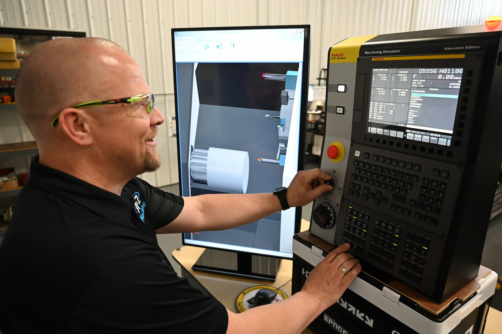

One of A to Z Machine’s missions is to be the machining industry’s supplier and employer of choice. That means going beyond what other machine shops can do by acting as a partner and consultant to customers, as well as committing to innovation, growth and development of its team. 

“One of the ways we’re doing that is through our machining simulator,” said **Marc Manteufel**, Manufacturing Engineering Manager and IT Manager. 

In this month’s blog, Marc shares the ways A to Z Machine’s machining simulator is used in both community outreach and in training the next generation of skilled machinists. 

## What is the machining simulator? 

“Our machining simulator is a stand-alone CNC machine control and operator panel paired with a computer and monitor that uses simulation software,” Marc said. 

The simulation software can “talk” to the CNC control, so it can perform the movements and functions as they are entered into the control.  

Essentially, the simulator acts exactly like a real machine tool by moving each axis, performing tool changes, making machining sounds, visually removing material and throwing metal chips as it cuts.  

“It is really close to the same experience as running a real machine,” Marc said. “I set up a large format TV in portrait orientation and gave it an ‘operator door’ bezel trim to mimic looking through the operator door of a real machine.”   

The machining simulator can simulate both lathes and mills. 

## How A to Z uses the machining simulator 

“The simulator is portable, so we like to take it to community events, like local school career fairs, tech ed classes, and more to help portray what we do here and one of the ways we train our team,” Marc said. 

In the shop, the team can load actual parameters from A to Z machines into the simulator. “That way, our maintenance technicians can diagnose problems, train in their procedures, and familiarize themselves with navigating through settings and parameters without the risk of messing up an actual machine tool,” Marc said. 

The device can also be used to train machinists using lessons saved for the simulator, he said. 

“These include a blueprint for each lesson’s part,” Marc said. “The trainee will have a mentor help him or her through the programming step using GibbsCAM (a CNC machine programming software) to generate the g-code (programming language).” 

Machinist trainees will load the g-code into the machining simulator control, enter tool offsets and work offsets, and run through their first piece on the simulator. During the first piece run through, the mentor will show the trainee how to navigate through the machine control and teach best practices for the “proving out the program” process. The mentor will review the “machined” part on the simulator and the g-code to verify that the trainee has learned the lesson. 

## How the simulator helps save expensive equipment 

“Trainees can explore the machine control and try things out without any risk of damaging or messing up settings on an actual machine tool,” Marc said. “This reduces the stress a trainee experiences when running an actual machine.” 

Plus, when trainees operate a real machine for the first time, they are more familiar with the control and the steps they take when running them because they have practice on the simulator. 

Giving machinists-in-training experience with the simulator before they operate a real machine, they’re much less likely to crash it. “This creates a safer work environment for them, and it means less downtime and repair costs for us.”

## Interested in working for A to Z’s high-tech machine shop?

Read more about our employee-owned company and become a part of A to Z’s precision machining team. 

<a class="btn btn-primary" href="/careers/">See careers at A to Z</a>
