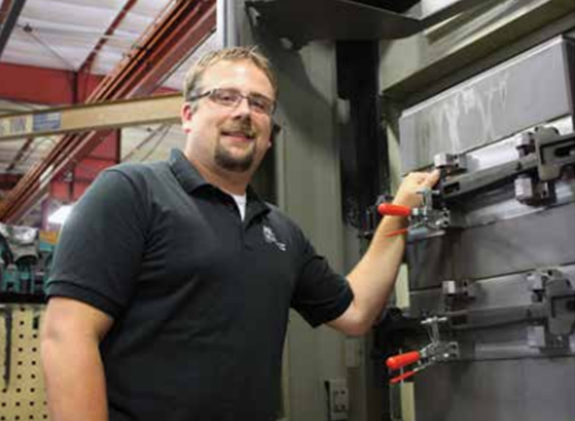

## Supervisor-Mills

### Paul Verhagen

#### A to Z Machine Company, Inc. Appleton

**What does your company make?** Machine parts for all sorts of manufacturing companies.

**What do you do there?** I pre-plan jobs, program and set up equipment, run machines, train and mentor employees. My job is very hands-on.

**What are the most interesting things about your job?** Using all the new technology to make cool parts.

**How did you decide on this career path?** My parents have jobs in the manufacturing field. I have very hardworking parents with a strong work ethic that early on taught me that if you wok hard, do your best, and put pride in your work you will be rewarded. My dad brought me to a machine shop where my uncle worked when I was 12 years old. I got to see firsthand what it's like to be a machinist. I was hooked: So much different technology used into making so many different precision parts for something bigger in the manufacturing field.

Watch Paul discuss his work at A to Z Machine Company, Inc.: <a href="https://newmfgalliance.org/" target="_blank" rel="noopener noreferrer">www.newmfgalliance.org</a>
