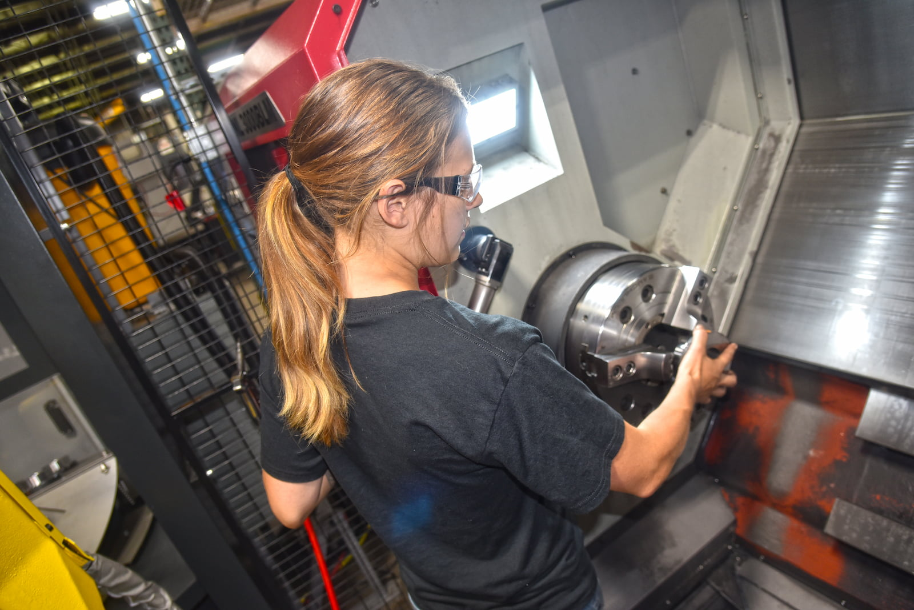
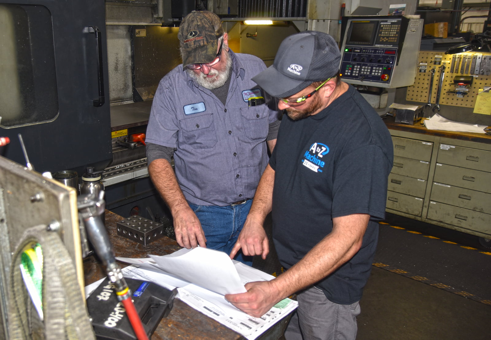
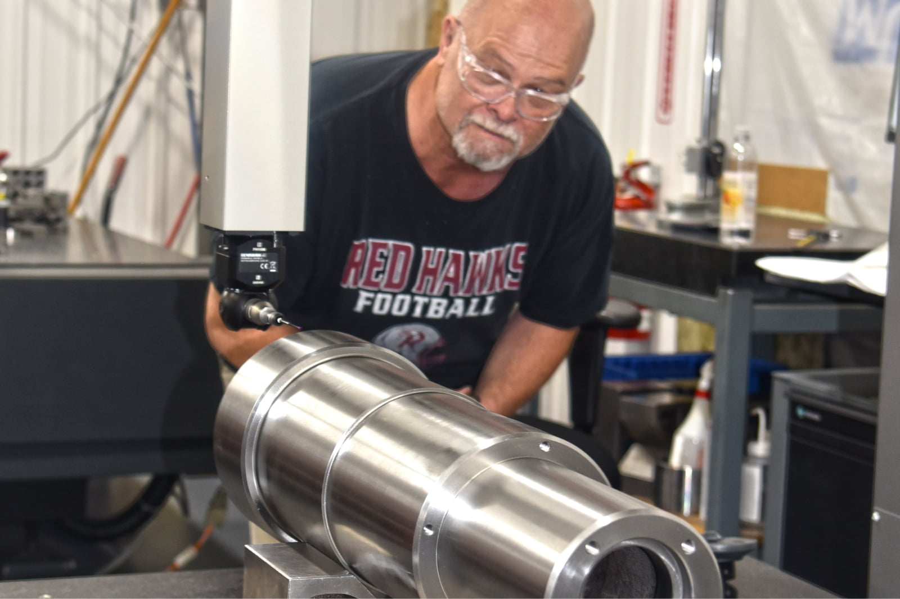

A to Z Machine’s expert machinists depend on the company’s state-of-the-art equipment and technology to create precision parts for customers. That means keeping everything up-and-running and operating optimally. 

“We look at our preventive maintenance program and how it applies to our True North philosophy, which is being the supplier and employer of choice,” said Dan Braun, A to Z’s Facilities and Maintenance Manager. “Being the supplier of choice, the purpose of preventive maintenance is to try to eliminate unplanned downtime and deliver our customer orders on time.” 

Keeping a regular preventive maintenance plan in place also helps A to Z meet its ‘employer of choice’ goal because it ensures the equipment is operating reliably, which helps everyone do their jobs well—and safely. 

In this month’s blog, Dan discusses how the team at A to Z keeps preventive maintenance top of mind each day. 

## How A to Z plans its preventive maintenance 

A to Z has a regular preventive maintenance schedule in place for 65 major machines and additional support equipment throughout its facilities. The company’s team of six facilities and maintenance technicians tackle each on an annual basis. “We try to stick to that schedule,” Braun said. “We know when each piece needs to be maintained, and we schedule our customer work around that.” 

It’s not just about keeping machines running, it’s also about keeping customer deliveries on time. While scheduled maintenance takes a machine out of production for that brief time—normally several hours to several days, depending on the type and size of machine—it’s far preferable to having to make unscheduled repairs. 

“If a machine breaks down, it could be down for an hour, or it could be down for a week,” Braun said. “If we’re doing good preventive maintenance, hopefully we can eliminate that downtime.” 

The team typically has a plan for each piece of equipment, checking components and replacing any about to wear out, checking safety features, as well as inspecting electrical components and reducing risk of breakdowns or fires. 

## Why preventive maintenance is important 

While the main goal of preventive maintenance is keeping the machines up and running so the company can meet customer demand, it’s also about ensuring quality of the custom-machined parts. 

With very specific requirements and tolerances for the precision parts that A to Z designs and produces for its customers, accuracy is paramount.  

“If our machines are starting to wear, it could become a quality issue,” Braun said. “We inspect each machine for wear or other issues, and we keep track of the history of each machine to determine if a machine has particular problems. We’re always working to stay ahead of any potential problems that may arise.” 

The team also will check the safety features of each machine and ensure everything is working well, and they will change oils, fluids, filters and any other regularly needed updates. 

## Maintaining vs. replacing equipment 

During the process of preventive maintenance, the team will consider aspects such as the age of the machine, how expensive it’s getting to maintain and replace parts, how reliable it is and how frequently a machine may be breaking down. 

“If it’s getting to a point where we are having trouble meeting customer commitments, and if a machine is getting too worn out or parts aren’t available, then it may no longer be profitable to continue fixing that machine,” Braun said. 

Braun works with the operations team and the executive leadership team to review its capital plan, and based on upcoming customer orders and the age of the equipment, they may make adjustments to accommodate new equipment purchases where needed. 

## How A to Z keeps ahead on preventive maintenance 

“Preventive maintenance keeps evolving,” Braun said. “We have a good mindset of continuous improvement, where we’re always reviewing, improving and creating more preventive maintenance plans.” 

Besides the main equipment that the crew maintains, A to Z Machine also schedules maintenance for the building’s air compressors, forklifts and utilities like the HVAC systems.  

“There are a lot of different things we have plans for,” Braun said. “For some of the facilities maintenance and things like forklifts, we contract with outside technicians to keep things running. But for most of the production equipment, we take care of ourselves in-house. We have a great team for that.”

## Interested in working with A to Z?      

Learn more about our company and how our True North philosophy shows up in everything we do. 

<a class="btn btn-primary" href="/careers/">Apply now!</a>