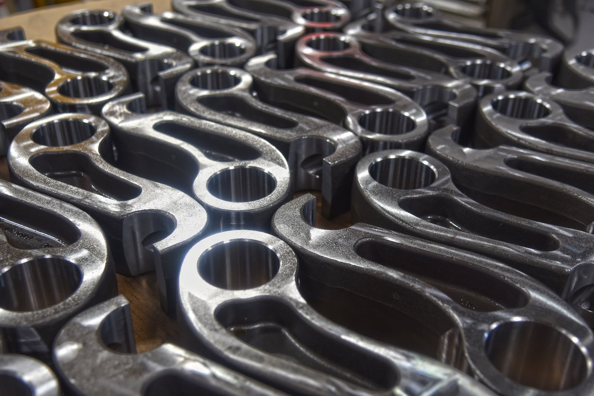
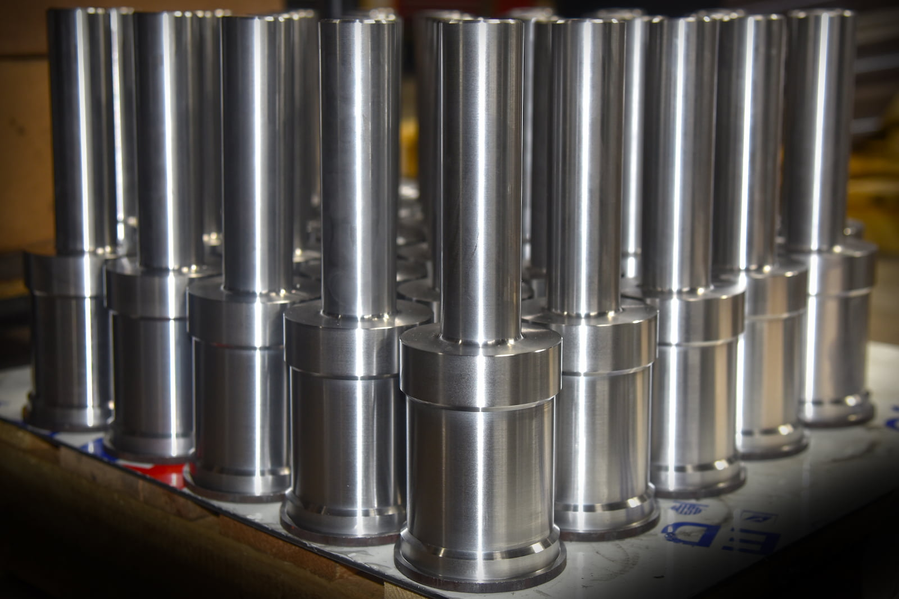

A to Z Machine, Northeast Wisconsin’s leading precision machine shop, is set up to serve two types of customers, said **Rob Hamel**, Sales Operations & Business Development Manager at A to Z Machine. 

“Our **job shop** specializes in custom, low-volume projects,” Rob said. “Meanwhile, the production machining side focuses on mid to high-volume repeat work. Together, these two units allow us to serve a diverse range of industries with flexibility and reliability.” 

The job shop side can accommodate small orders, even just one precision part at a time. The production machining side, on the other hand, accommodates orders from about 500 pieces up to 10,000 pieces annually.   

“We have the capacity to run much higher quantities, but really that’s our sweet spot,” Rob said. “Our specialty is mid-volume production machining of complex castings.” 

## Production machining capabilities 

A to Z machinists produce parts “from a variety of different materials, including cast steel, stainless, grey iron, ductile iron, austempered ductile, aluminum, and high temp alloys,” Rob said.  

The components made by A to Z are used in a wide range of industries, including agriculture, engineering and construction, defense, trucking/transportation, recreational vehicles, marine, oil and gas, and many more. 

A to Z’s production machining center houses 15 machines primarily centered around horizontal and vertical machining equipment. “A to Z can accommodate parts small enough to hold in your hand to much larger components that might be five feet long,”  Rob said. Parts can weigh from about five pounds up to a thousand pounds. 

“We have jobs that run on the same machine every day of the year, or we may run a part for two weeks and do a fixture changeover for a different job,” he said. “Our engineering team does a great job of designing fixtures that are easy for our machinists to load and changeover to the next job.”  

One special piece of equipment is A to Z’s Mazak Palletech system, housing two Mazak HCN-6800 large horizontal machining centers that are connected to a load center and 28 28-pallet rack. The machinist loads parts onto individual pallets. This pallet is then sent to the pallet rack and will be pulled into the machining as demand for a production part is required. “This helps us minimize idle time, allowing us to produce parts to meet our customers’ schedule,” Rob said.  

## A day in the life of production machining 

As Business Development Manager, Rob’s focus is to bring awareness to new and existing customers of A to Z’s capabilities. He works closely with customer manager Don Berry and the engineering team headed by Marc Manteufel to ensure A to Z can meet customers’ requirements, work with engineering on any needed changes to design, and provide quotes for producing the parts. 

Quality Assurance Specialist Nick Chitel works as a PPAP (Production Part Approval Process) specialist, ensuring that A to Z follows all customer specifications. 

Lead supervisor Eric Siebold will then manage the flow of work, reviewing the daily schedule to determine when particular jobs must be run, how to batch them together, and make sure there’s a solid inventory of cast components, steel or other needed raw materials available. 

“That team of four is leading the charge from the production side to make sure that jobs flow through the shop properly, and we deliver quality parts on time,” Rob said. 

Then A to Z’s team of machinists ensure that the parts are manufactured according to specs on a day-to-day basis. 

“The machinists are cross-functionally trained so they can run different machines on different days if needed to fill in for each other,” Rob said. 

For those who are thinking of going into a machining career, A to Z’s production machining area would be a great place to start. “We’re always looking for experienced machinists, but we’ll train the right people as well,” Rob said. 

## Production machining and the True North philosophy

A to Z’s True North philosophy means the company’s purpose is to be the machining industry’s supplier and employer of choice. It includes a number of guiding principles that shape everyone’s work on a daily basis.  

“One of those is we ‘embrace continuous improvement,’ and that’s a really big focus on the production machining side,” Rob said. “Part quality and cycle times are important to our end users, so we’re continually trying to improve the process and deliver value for our end users through cost savings.”

## Interested in working for A to Z’s production machining shop?

Read more about our employee-owned company and become a part of A to Z’s production machining team.

<a class="btn btn--primary" href="/about/culture/">Learn more about A to Z</a>
