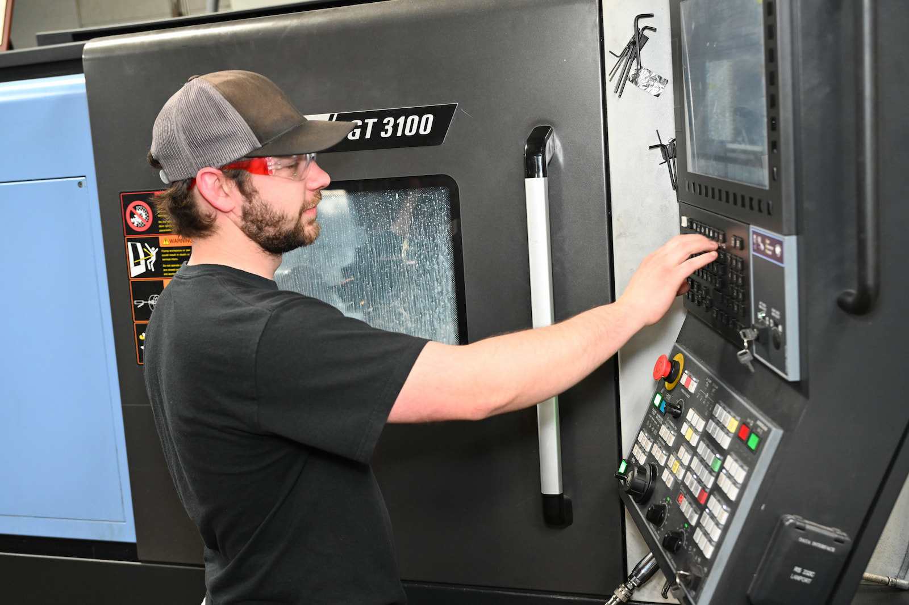
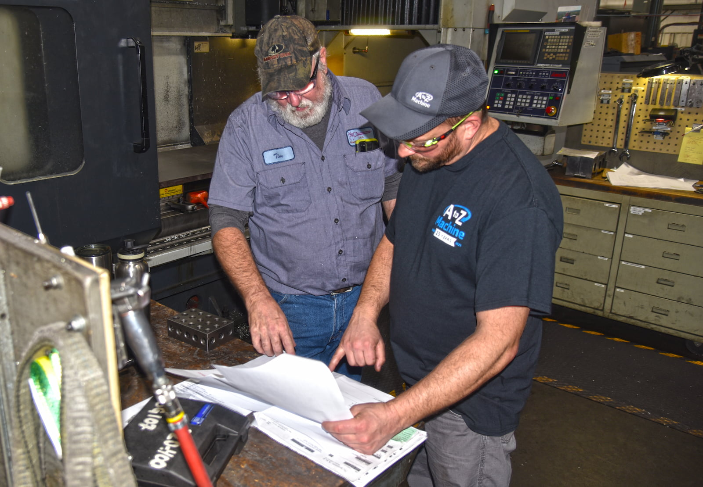
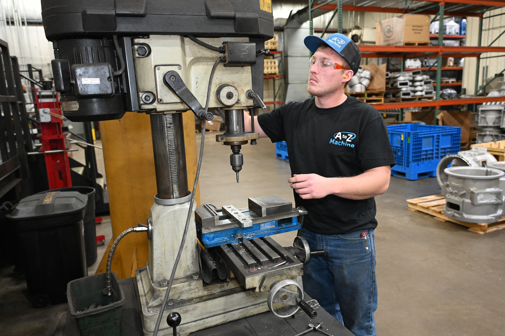

As Northeast Wisconsin’s leading precision machine shop, A to Z receives orders from customers who need industry-specific precision parts—sometimes a low mix, high volume order—but more often a high mix, low volume order. 

That means the team must schedule these jobs precisely to keep the company moving and to keep its customers happy. 

“Essentially, the customer managers bring in the order and enter it into our system, and then it’s up to me to try to figure out where it’s going to run and how it’s going to get done,” said **Ryan Stortz**, ERP Scheduler at A to Z Machine. “We prioritize the jobs and move things around if necessary to get the parts out to our customers on time.” 

Scheduling can be complex, with parts occasionally needing to move through twenty or more different machines before they're complete. In this month’s blog, Ryan talks about what’s involved in scheduling jobs at A to Z Machine’s precision machine shop and how A to Z ensures they deliver top-quality parts on time.

## Keeping communication open

A to Z’s customer managers, most of whom have been project managers or machinists in the past, take orders and develop the necessary process for creating a part. They could be made on any of more than 50 different types of equipment, including lathes, mills, surface grinders, welding machines, saws, production machines and engravers. 

“I tell them what we have openings for based on all the work that’s in the system, and we put together a lead-time report, which tells us what’s available and when,” Ryan says. 

Ryan acts as a mediator and communicator between the front office and the shop floor, making sure everyone is as informed as possible about each job. The team develops schedules and has a weekly meeting “to get everybody at a high level on where things are and where we need work,” says Ryan, who will also deliver reports and spreadsheets for customers “so they know where their parts are and what to expect.”

## Considerations when scheduling a job

In scheduling a job, A to Z needs to consider what kind of material is needed and how large it will be. They also try to group jobs using the same types of materials, such as those needing aluminum or stainless steel.  

“We look at those options when we’re grouping jobs at a machine—it saves more time because our team doesn’t need to clean it out as often if they’re running the same type of material, and keeping the same type of material together will be better for us when we recycle scrap metal.” 

A to Z also figures in time for outsourcing when necessary, which might occur when parts need different types of painting, coating or anodizing. 

“Once a job gets entered, we kind of just start looking at everything—we see where all the current load is, which area it’s got to run in, and then if we can’t get it done, how do we either change the routing, the way it’s processed, or how do we move it to a different area to get done—and still give the customer their parts on time?” 

A to Z often receives repeat orders for the same part, “so we can look at history to see where that part number has run before. We have it routed a certain way that’s most efficient, so it’ll always come through the shop that way,” Ryan said. “But if the machine is booked and we have to move it somewhere else, we have the opportunity to see where it may have run in the past, and we can get it to another home. The aim is to be the most efficient for our customers.”

## Staffing considerations

A to Z has a specialized team of CNC machinists, welders, grinders and others who know how to operate the precision machinery. They keep track of upcoming vacation time when planning a project. “You’ve got to consider that we have a lot of machines operated by the same skilled people, so when they’re on vacation, you may not have an opportunity to run that equipment,” he says. In that case, time is taken off the system for those machines so the team knows that person is unavailable during that time. 

On the flip side, A to Z also ensures that not every skilled worker is off at the same time. 

“We have some manual work that some of the more senior people know how to do,” Ryan says. “Some of our younger workers may not know some of the manual brake presses and things like that. It’s a hard skill to teach because our senior team members learned it over time.” 

Still, the team always finds a way to make things work, Ryan says. “If someone takes time off, life isn’t over—we communicate between departments, and everybody just picks up the job wherever they can and keeps it moving forward.” 

## When things get busy

The A to Z team also works with Ryan to keep projects moving even when there’s a lot to get done. 

“We’ll look at where a job has to run and determine if there’s any way to move different products around or group them together to run more efficiently,” he says. In a 40-hour workweek, “you might be able to get 60 hours worth of work done because of the way you scheduled or because you ran the same material together, or those with the same diameter.”  

If they can use the same tooling, “you’ve saved a lot of time on setups to get all that work done.” Occasionally, the company will outsource to other precision machine shops when there’s no other option for scheduling at A to Z. “We then inspect each part to our quality standards and then ship it out, so there’s no time off our books,” Ryan said. “We’re always looking at the best options to get the work to our customers within their time frames.” 

A to Z also keeps the lines of communication open with customers and sometimes confers with them about which job should be prioritized. “We always have a goal of keeping our customers happy and aware,” he says. 

## How A to Z stands apart 

“I think we have a strong general knowledge overall, and everybody in the company plays a part,” Ryan says. “I think we’re unique in that way. We have a lot of individuals here who are just doers. They figure out ways to make things work and are creative, almost like an engineer-type person.”   

## Interested in working for A to Z’s high-tech machine shop? 

Read more about our employee-owned company and become a part of A to Z’s precision machining team.

<a class="btn btn--primary" href="/about/culture/">Learn more about A to Z</a>
