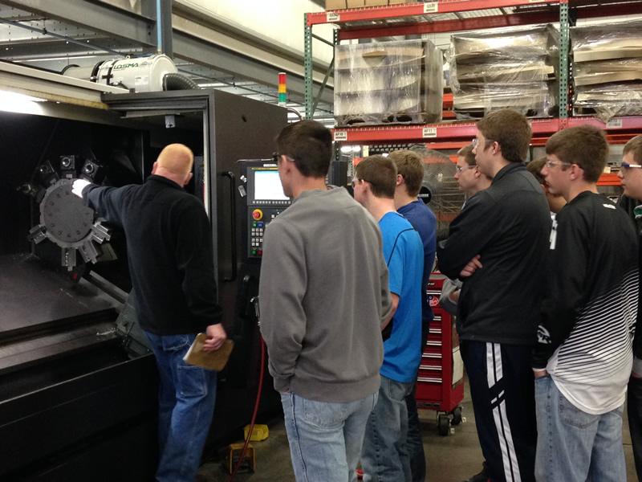

Engaging in educational programs and reaching out to the community is one way that A to Z Machine helps build the next generation of skilled workers for its team.  

“Whether that’s through our award-winning Youth Apprenticeship program, visiting schools, or bringing students to our facilities, A to Z staff is always ready to showcase our company” said Sydney Wilcox, A to Z Talent Acquisition Specialist. 

In this month’s blog, Sydney shares how the company stays engaged and why that’s important both to A to Z and to the industry as a whole. 
 
## A to Z Hosts a Robust Youth Apprenticeship Program

[A to Z Machine’s Youth Apprenticeship (YA) program](/blog/youth-apprenticeships/) helps juniors and seniors build skills and explore careers, and it’s a way for the company to develop the next generation of machinists. The company works with local high schools and CESA 6, a nonprofit educational services agency, to facilitate the program. 

In the YA program, students earn class credit, and A to Z Machine is accountable for reviewing apprentice performance, meeting standards and reporting back to the schools throughout the school year. Students get the chance to work in different areas of the shop and work with mentors who help them learn the trade. 

“We do regular check-ins with the kids, and make sure that they’re progressing as well as we hope,” Sydney said. “We have weekly training and developing meetings in which we discuss each student individually to make sure that they’re learning and understanding our process. I think we do a good job making sure that their learning experience is as complete as can be and setting them up for success in that way.” 

In 2022, A to Z’s YA program was recognized by the Northeast Wisconsin Manufacturing Alliance with an Excellence in Manufacturing-K12 Partnership Award for its success in the community. 

With about 15 percent of A to Z’s workforce as either current or former youth apprentices, “that just goes to show that our process to train these kids is working,” Sydney said. 

## A to Z Sends Guest Speakers to Schools and Events

“We’re trying to make ourselves known as much as we can,” Sydney said. “There’s a statistic out there that says you have to see something about eight times before your brain registers it, so we’re trying to be as present in the community as we can.” 

This month, for example, the company planned to send a guest speaker to Kaukauna High School, which offers the chance for A to Z staff to give away some swag, talk about the industry and highlight some career possibilities. 

“Not only is it good for our company, but I think it’s good for our industry as a whole because machinists are a dying breed,” Sydney said. “The career isn’t talked about enough—to the point that people don’t know what machinists do.” 

Additionally, talking to students helps highlight that there are great career paths that don’t require a traditional four-year college degree. This may be of particular interest to those kids who enjoy making things, working with their hands or figuring out how things work.  

A to Z Machine also attends career fairs and other events where they can feature their company. When Sydney brings machinists to the events, they are often those who participated in the [YA program](/blog/investing-in-youth/), so they can talk about how the program works and how they progressed in their careers.  

“I think the more we take advantage of these opportunities to get out there and show our brand and talk about our company and what we do, the better chance we have of getting people to see us and maybe spark interest in a career with us,” Sydney said. 
 
## A to Z Offers In-House School Tours 

A to Z Machine also works with area high schools to arrange class tours followed by a Q&A where students can ask team members about their jobs. 

“We do all the work to get kids here to see the facility,” Sydney said. “It’s one thing to talk about it, but I think it’s another thing to actually show them some of the cool products that are made and the atmosphere here.” 

A to Z consults with the company’s safety manager to ensure the visit is safe for the students, and everyone on the floor is notified when students will be coming through.  

Students are provided with necessary safety equipment, such as earplugs. “The people that are leading the tour are doublechecking that anytime someone enters the facility, that they have their necessary PPE on, and at all times it’s supervised.” 

## Parents Can Make an Appointment to Tour A to Z With Their Kids

For parents who have students who may be interested in working in a manufacturing career, there’s always an opportunity to come down to visit A to Z. 

“We’ll definitely always take those opportunities and let people see what we got going on,” Sydney said. “We’re proud of what we have here, so we love when people want to come in and see it.” 

A to Z not only offers tours for parents and their kids, but can also arrange a job shadow for a couple of hours.  

“Or we can offer a Q-and-A session with someone who is in a role that a student might be interested in,” Sydney said.  

## A to Z Team Members Also Build on Their Own Education

Just as A to Z works with schools to help educate students on the industry and train a new generation of machinists, the company values supporting its employees in the educational endeavors they want to pursue later on. 

“For example, we have someone in our maintenance team who’s looking to go to school to learn a different area in the company, and we are extremely supportive of that,” Sydney said. “In our philosophy, we hire and retain good people, and wherever they feel they can best be an asset, we always support that.” 

A to Z has lots of people working in the company who have more than 20 years of tenure, and that’s also a benefit for the next generation who starts working here.  

“The people that have been here for a long time are so keen on giving back, and sharing that knowledge with our youth—I think that’s huge,” Sydney said. “In the time I’ve been here I’ve noticed that our company has the kind of environment where everyone wants to help everyone learn.” 

## Interested in Visiting A to Z?      

Learn more about our company and see how A to Z’s team works together on precision parts every day. 

<a class="btn btn-primary" href="/contact/">Contact Us Today!</a>