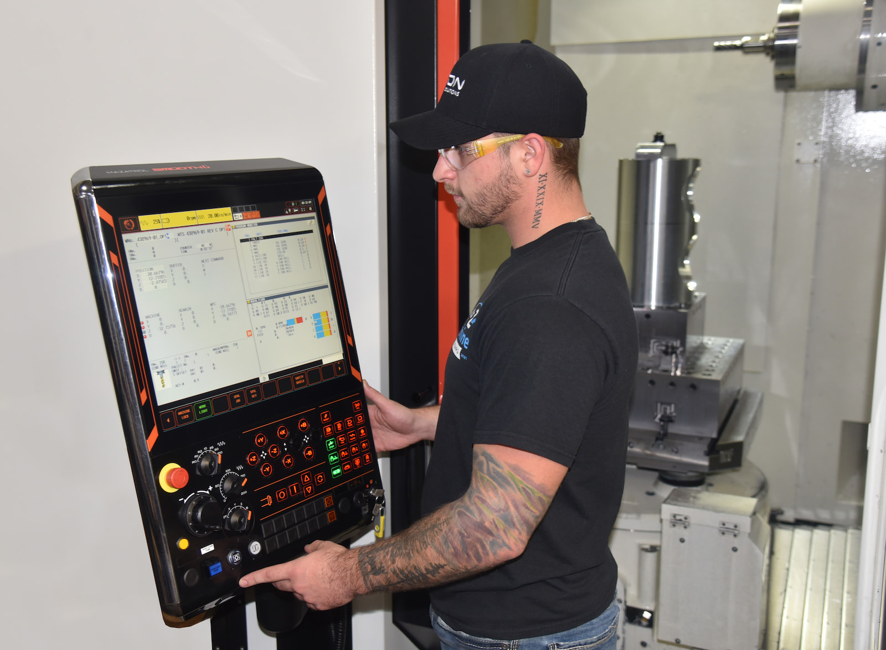

As Northeast Wisconsin’s leading precision machine shop, A to Z Machine is always on the lookout for skilled talent. To help keep the company competitive in hiring, the company decided to make a key change to its second shift schedule, which already offered a four-day workweek and a 7 percent shift premium. 

“Lots of people start early in their career on second shift because you get paid more and you get longer weekends,” said **Sydney Wilcox**, Talent Acquisition Specialist for A to Z Machine. “But a lot of times what happens is later they’ll have a family, and then their kids have events and activities that happen during the evening. So then they’ll want to switch to first shift.” 

Currently, our first shift generally works five days per week, 6 a.m. to 3 p.m. Monday through Thursday, with most people out by noon on Friday. 

Our second shift will now be made up of three 12-hour shifts from 3 p.m. to 3 a.m. Monday through Wednesday—or 36 hours—freeing up an extra weekday for those workers. What’s more, they’ll still be paid for 40 hours. 

“It’s the best of both worlds,” Sydney said. “It keeps us competitive in recruitment. I hear it over and over again: ‘If you guys offered a three-day workweek, I'd consider it more.’ Several other shops in the area are offering a similar schedule, and we made the change to remain competitive.” 

It’s a great option for those seeking longer weekends, but it also creates an incentive for those who live farther away to work at A to Z—fewer days means less traveling and less money spent on gas. 

Those team members who do want the overtime still have that option, Wilcox said. “We really listened to what our second shift people had to say,” Sydney said. “We're always going to have voluntary overtime to work that fourth day.” 

## Why the second shift change makes sense 

Overall, it’s generally harder for companies to recruit for second shift, and A to Z leaders had been discussing making a change to the schedule for some time. After conducting additional market research, the company decided the time was right. 

“It’s important in the days when everybody's looking for workers and everything is so competitive, so it’s one way to think outside the box,” Sydney said. “We’ve got to keep ourselves competitive so we can attract and retain the best of the best. And to do that, sometimes you just have to adjust to what the candidates are looking for.” 

“The change has gone over well at A to Z. Some 2nd shift team members who were considering switching to first shift have decided to change their minds and stay on second shift,” Sydney said. Some working first shift have contemplated switching to second shift now that there’s a three-day workweek. 

“It's definitely enticing in a lot of ways,” she said. “Hearing that stuff from our own team is super nice. And we've had a couple of people that have already applied because the word has gotten out and they're like, ‘Yep, that was the push I needed to finally apply.’” 

While there are pros and cons to working either shift, one of the cons for the second shift team has been that they don’t always have access to all the same resources such as office staff and training opportunities, Sydney said. But A to Z has made another change to address that issue. 

## Offering a trainer on 2nd shift 

Recently, A to Z Machine promoted Jamie Fischer (a long-term, skilled machinist on A to Z’s 2nd shift), to a trainer position on second shift. Jamie’s role is simply that—to train team members on different aspects of the equipment, machinery and precision skills. 

“He's been with the company for a long time, and he is super knowledgeable,” Sydney said. “And we have a lot of younger people on second shift, which is typical. A lot of people starting off in their careers like to be on second shift. So having that resource for them is valuable because then they have someone there to help if they need anything.” 

The feedback has been wonderful. “It's going really, really well. And not only from an actual productivity standpoint, but from a morale standpoint, knowing that the company cares about their development.” 

## 2nd shift schedule change and the True North philosophy 

A to Z Machine’s True North philosophy is focused on fulfilling the company’s purpose of being the machining industry’s supplier and employer of choice. That includes being intentional with culture, offering job stability and minimal fluctuations in hourly schedules—leading to greater employee satisfaction. 

“We understood we needed to do something else to be more attractive than the other companies that are also doing the same,” Sydney said. “We had to put ourselves in the mind of a job seeker. If I had four offers on the table, what are some things that would make me choose one over the other?” 

“A to Z leaders knew it would take a little bit of work to make the change, but to truly be the employer of choice as the company’s True North philosophy states, then it was important to make the adjustment,” Sydney said. 

“I believe strongly in everything that we do already offer, between being just a good company with a good reputation and the benefits we have, being employee-owned, and the work we do,” Sydney said. “I think that with the growth we've had, this is just another added bonus. If you've already considered A to Z, this is what could seal the deal.”

## Interested in working for A to Z’s production machining shop?

Read more about our employee-owned company and become a part of A to Z’s production machining team.

<a class="btn btn-primary" href="/about/culture/">Learn more about A to Z</a>
