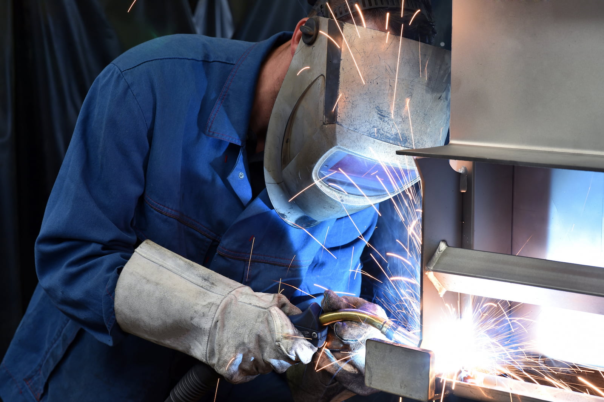

A to Z Machine in Appleton, Wisconsin, relies on the talent of its welders and fabricators to help complete expert, high-quality projects for its clients. 

“Welding and fabrication is a great field for people who like to work with their hands and are mechanically inclined,” said Tim Miller, fabrication shop manager at A to Z. Miller also taught welding at a technical college and says education is a plus, but that’s only part of what makes a great welding and fabrication team member.

In this month’s blog, Tim discusses the vital role that A to Z welders and fabricators play in keeping projects on schedule, and what qualities are needed to enter the field.

## Is there a difference between welding and fabrication?

Welding and fabrication are a specialized part of the same manufacturing process, Tim explains. “Fabrication is the making of the components, and along with that can include welding.” 

A to Z technicians will create weldments—which are two pieces of metal joined together—which then go to the machining process. There are often complex requirements regarding tolerances for stress for the components. Welders often will start with materials that are thicker than the end product will be as the machining process will remove some of the thickness. 

“You might start with something that doesn’t match the print, necessarily,” Tim says. That means welders and fabricators need to have the ability to think ahead and work through the steps of a project before starting.

## What other skills do you need for welding and fabrication?

Welders begin with different levels of skill, but basic knowledge includes knowing the different types of materials—carbon steel, stainless steel and aluminum. They also need to have a basic understanding of hand tools, including tape measures, calipers, squares, grinders and saws. Reading a print and understanding the notes and symbols and applying them properly is a key part of the job, Tim says. “But all of those things are trainable—a positive attitude is the most important.”

Other soft skills like being a problem-solver and being able to multi-task are important as well. “We like people who can think on the fly and don’t get confused in a busy environment, because there are a lot of things that can be going on at any one time,” Tim says.

## What’s something people might not realize about the job?

While lots of manufacturing jobs are becoming more tech-oriented, welding and fabricating are still among the roles where you get your hands dirty. “Taking care of your health, like the proper personal protective equipment (PPE), is very crucial,” Tim says. 

Safety glasses and filter lenses protect your eyes from particles and bright light; respirator helmets or masks help protect your lungs from fumes and particles. Ear plugs or other ear protection help you protect your hearing for later in life, he says.

## What might a typical day be like for welders at A to Z?

A to Z is a job shop, completing many one-off projects and custom builds for its clients, Tim explains. Once A to Z receives a project, “we’ll do preplanning to see what the machine shop needs to machine into a part first,” he says. Then the team will decide how best to process the parts, which may include outsourcing.

“Then we have to decide how to put the parts together—what is our most efficient manner?” Tim says. The process will be double-checked, the parts welded to code and the end product inspected. The weldment also may be heat-treated to help relieve stress that can build up in the welding process. Machinists will then complete the order.

Welders may work on projects that take just an hour and a half, or they could be on a large project that takes up to 100 hours. “It’s varied quite drastically across the board,” Tim says.

## Interested in joining our team of welders and fabricators? 

Join our employee-owned company and become a part of this dynamic team. Currently, the welding & fabricating team works Monday through Friday from 5 a.m. to 5 p.m.

<a class="btn btn--primary" href="/careers/">Apply now!</a>
