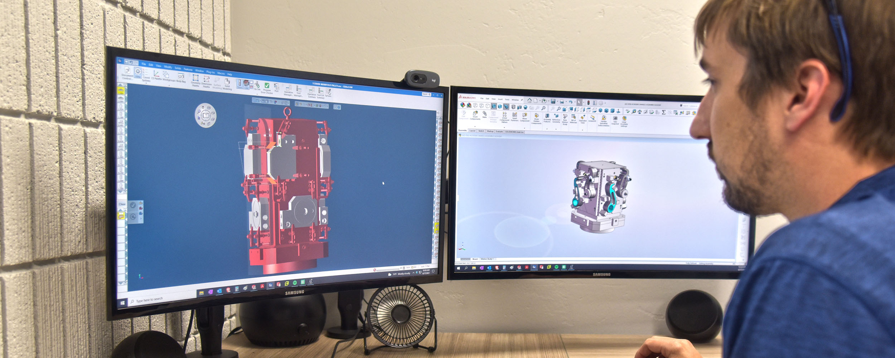

   

A to Z Machine uses a wide range of software at its production facilities in Appleton, Wisconsin, to help it design precision parts and ensure its machinists can carry out the production efficiently. 

“Epicor is probably the most used piece of software across company departments,” said AJ Billingsley, IT Support Technician for A to Z. “But that’s just one of many types of software our team uses each day in our operations.” 

In this month’s blog, AJ talks about the many types of software used by A to Z staff every day, and how the company keeps it up-to-date. 

## Epicor 

Every day, A to Z staff uses Epicor, an ERP (enterprise resource planning) system that the company first implemented in 2020. ERP systems centralize most day-to-day operations and are commonly used in manufacturing companies. 

This system handles everything from managing employee time, tracking maintenance requests, quoting for parts, entering sales, shipping and receiving, scheduling orders and more. 

“Most of us work in in Epicor in some form or capacity—it’s a very robust piece of software, and it’s going to scale with us as we grow,” AJ said. 

## SolidWorks 

A to Z also uses SolidWorks which is a 3D CAD (computer-aided design) software tool. “It’s used heavily by our engineers and our customer managers,” AJ said. “You can take a design or blueprint and create a 3D representation of that part, or you can even create a blueprint for a part from the ground up.” 

3D quality helps engineers to ensure their ideas and designs look like they envisioned, and it helps customer managers to show A to Z customers their designed part prior to the finished product. 

## GibbsCam 

Used in conjunction with SolidWorks, GibbsCam takes that 3D design and sends the plan to A to Z’s CNC machines using a program link called G-code. “That tells our CNC machines how to create that part,” AJ said. “So, it takes that design concept and turns it into a language that our CNC machines understand.”  

That includes which tools to use, how deep the cuts go and what order to go in to create that part. The software is used by engineers, programmers and some shop floor staff.  

## eViewer 

eViewer is a piece of software used on the shop floor to look at the 3D models created by engineers in SolidWorks.  

## Draftsight 

Draftsight is similar to SolidWorks but it only works in 2D, which is especially helpful when a design has multiple layers. It’s used mainly by engineers who work with blueprints.  

## eNET 

eNET is a DNC (direct numerical control) software that works when the G-code is created and programmed, allowing A to Z to upload that programming into CNC machines. “These programs can be very long, so instead of manually entering them into the machines, eNET allows us to pull that program into the machine directly so that they can start right away.” 

eNET monitors machines, so A to Z can monitor efficiency, find any problems in the manufacturing process and ensure quality. 

## PolyWorks 

PolyWorks is used with handheld 3D scanners, allowing the A to Z team to take accurate measurements of parts. The production shop scans a part and PolyWorks tests to make sure that that area of the part is within the correct measurement tolerance for the design, AJ said.  

“It allows us to be accurate within a range thinner than a human hair,” he said. “It’s very accurate.” 

## PC-DMIS 

PC-DMIS is software used by A to Z’s inspection quality team. It programs a CMM (coordinate measuring machine) to examine a part. PC-DMIS tells the CMM what the measurement should be, and when the CMM takes the measurement, the software says whether the measurements are correct or not. The CMM is basically a large table with an automated probe that takes the measurement. 

“We can show the results to customers and let them know if there’s issues with quality, or if everything looks great,” AJ said. 

## Office products 

A to Z also uses Microsoft 365 apps for business, such as Excel, PowerPoint, Word, Outlook and other administrative software. It’s used on the shop floor and by office staff. 

## Cloud-based Software 

A to Z uses 1factory, a cloud-based software for automating quality control and for keeping track of when gauges are due for calibration. 

When A to Z has a PDF blueprint, “we can load that PDF into the software, and it automatically points out all the different tolerances and things that we need to make sure that we are making the part correctly,” AJ said. 

## Proprietary Software 

A to Z Forms is a proprietary software developed specifically for the company. It uses Microsoft Access as its backbone, and it is used mainly by shop floor personnel and the tool room. “It allows our machines to make a list of the tooling that it needs for a job, and A to Z Forms sends the list to the toolroom,” AJ said. “Or if they need certain gauging measurement tools, that’s automatically seen by our toolroom and then they can deliver the parts.” 

The software also is used to create setup sheets, which show how the machine should be set up before making a part. “So the next time somebody who has never worked on that part will have a reference for how the setup should look.” 

## How A to Z Machine keeps it all updated 

Each of the software programs comes out with updates, typically about once a month or sometimes once a year. 

AJ will coordinate with the A to Z team to update software at a good time in the production schedule. Whenever software such as SolidWorks, DraftSight and GibbsCam are updated, he’ll work with the engineering team to update each computer and ensure everything is working correctly. 

“If we’re having issues with any of the software, we see if they came out with any kind of patches, and then we’ll start updating all the computers to the newer version to make it more stable,” AJ said. 

## Training staff to use the software 

Most experienced machinists will already have seen or used some of this technology in one form or another, but A to Z makes training available to its machinists whenever new technology is integrated into existing machines. Some software like GibbsCam offers online training.  

Epicor may take some in-person assistance to train people on the system and how it applies to their particular job function. 

“Thankfully, we have a leadership team that supports training and ensures we have the time and resources to stay up-to-date,” AJ says. 

## Interested in joining A to Z?      

Join our employee-owned company and become a part of A to Z’s precision team. 

<a class="btn btn--primary" href="/careers/">Apply now!</a>
