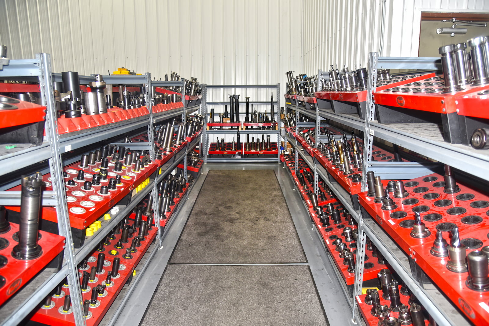

   

In fall 2023, A to Z Machine completed expansion on one of its production facilities in Appleton, Wisconsin, adding 30,000 square feet as a part of its strategic plan to support continued growth. As a part of that facility, A to Z installed a new tool room to better support its production side.

“Our new tool room drives efficiencies and offers better support for the production team at our newly expanded facility,” says Marc Manteufel, Manufacturing Engineering Manager for A to Z. 

In this month’s blog, Marc talks about how the new tool room improves efficiency and benefits clients of A to Z Machine.

## How adding a tool room helps the team
Prior to setting up the tool room in the new building, A to Z had been running tools back and forth from its building at 2701 E. Winslow Ave. to its building at 2900 N. Roemer Road, using an electric car purchased for that purpose.

“We’ve had multiple buildings in this industrial park for a few years, and one central tool room in our 2701 building that supports all the machinists and all the buildings,” Marc says. “So we were doing a lot of running back and forth.”

As a part of the expansion project, A to Z decided to add a tool room and inspection room within the 2900 building to support its operations. The tool room was set up in March 2024.

A to Z purchased new equipment, including a coordinate measuring machine (CMM)— for extremely high-precision measuring—as well as a workbench desk, heat shrink machine, tool pre-setter, tool cabinets and a vending machine for consumable tools such as carbide inserts, tabs, sandpaper, ear plugs and safety glasses.

## The function of a tool room

The staff in the tool rooms support all the CNC machines at A to Z by setting up the necessary cutting tools and gaging for making precision parts for customers, Marc says. Staff assemble various tool components and pieces into the tool assemblies, including a tool holder, retention knob, cutter body and inserts.  

“We have a digital custom software that we developed for the shop floor to request tool and gauging lists from the tool room,” Marc says. The tool room receives those orders digitally, and the software schedules orders and sends tooling staff a cue to assemble a tool kit and a gauging kit.

“We have a huge inventory of tooling, tool holders and gauging in the tool rooms,” Marc says. Once the tools are assembled and inspected, they’re delivered to the machines by A to Z’s Autonomous Mobile Robot (AMR), named TED, for Tools Efficiently Delivered.

## How the tool rooms are different

Now, the new tool room in the 2900 building operates in a similar way. Because it’s a production facility—which fills orders for larger and ongoing projects—its tool room will mainly replace broken or worn-out tooling, Marc says.

The main tool room at the 2701 building contains a much larger inventory because they need a wider variety of tooling to support the job shop side, which supports made-to-order precision parts. 

“The work there is different every day and every week,” Marc says. “We don’t know what we will need for tooling, so they have to have a really big variety and inventory. They’re building custom-tailored tool lists every day, and each tool is different than the one before.”

It makes sense to set up the two tool rooms to focus support on each side of the business. 

“That goes along with our strategy of building that addition—to separate out the production side of the company and support it better and gain efficiencies, because there’s so much that’s different about each side,” Marc says. “They require a different level of support and staffing. By separating it out, we’re able to fine-tune and support each one better.”

## The results of having two tool rooms

Since the new tool room was set up at the 2900 building, the production team has had their tooling needs addressed much sooner, eliminating a multi-step process. 

“They’re not waiting for transportation and for staff to come over from across the street and deliver the tooling and then take it back,” Marc says. “Now they can just walk into the tool room and get their tooling taken care of right on the spot.”

For the tooling in the 2701 building, they no longer have the distraction of having to deliver or pick up tools multiple times throughout their shift. “They have a lot more time to focus on supporting the team over here,” Marc says.

Also, both tool rooms and shop floors are fully climate-controlled. “It’s an inspection lab, so there’s a standard that everything is inspected at 68 degrees Fahrenheit,” Marc says. “The gauges and the parts themselves can grow and shrink based on temperature.” Controlling the climate ensures everything stays within spec and gives A to Z accurate measurements. “It’s one of the ways we ensure quality for our customers.”

## Interested in joining A to Z?     

Join our employee-owned company and become a part of A to Z’s precision team.   

<a class="btn btn-primary" href="/careers/">Apply now!</a>
