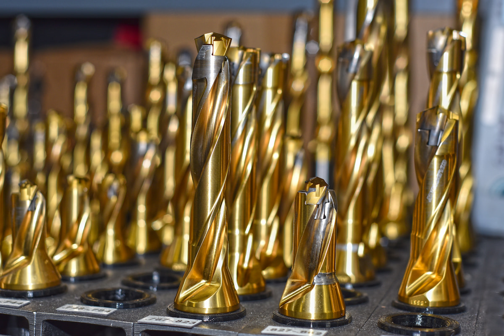

Machinists at A to Z Machine use a variety of carbide tooling technology to create precision metal machine components in its shop in Appleton, Wisconsin.

In this month’s blog, Nick Lingenfelter, manufacturing engineer for A to Z, talks about the types of tooling technology that machinists work with each day and how it helps them to fill those precision orders for a variety of key industries.

## Precision tooling for a precision world

A to Z Machine is a job shop that makes parts for high-end machinery used by industries like defense, marine, medicine, energy, trucking, electronic and food processing. Machinists work with different types of Computer Numeric Control (or CNC) machines that use tools to cut away metal to make needed components for these industries—most of which have very specific requirements. 

“The tools you use have to be precise,” Nick says. “All the tolerances are getting tighter because we’re working with precision industries, so the tooling has to be really good to meet these requirements.”

For example, A to Z Machine is making some parts connected to the space industry, which naturally has very tight specifications for its parts. Too large, and the parts can stick; too small and that can mean too much movement within the complex machinery. 

## Types of tooling technology

Machinists work with different kinds of equipment to make different types and sizes of parts. CNC equipment includes vertical machine centers, horizontal machine centers, CNC boring bars and a variety of lathes. With a vertical machine center, for example, the tool turns and the part is stationary, with the tool pointing down vertically. 

“That type of equipment is useful for parts with holes or complex machine features—pretty much anything that a lathe won’t do,” Nick said. With lathes, the part turns and the tool is stationary, and that’s useful for round parts. Horizontal machine centers operate in the same way as vertical machine centers, except sideways, and the part can be turned.

CNC boring bars are similar to the horizontal machine centers, except they are larger, heavier-duty machines used for cutting larger parts.

## Working with tooling technology as a machinist

One great thing about being a machinist and working with tooling technology is you can see your work in action.

“When we do components for military trucks or fire trucks, you see them on the road and then you can see the parts that you made on the vehicle—that’s really kind of cool!” Nick said. “I like that we’re always making different kinds of parts, and each day brings a new challenge.”

While it’s helpful to go through a technical college program to learn machining, you also can learn on the job, he said.

“If you have the willingness to work and learn, you can work your way up and become a machinist,” Nick said. Most often, machinists begin as operators, which run production jobs where things have already been planned out for you.

## Machinists are always learning

A to Z Machine uses the latest tooling technology, as new grades of cutting tools are continually coming out, allowing greater precision in making parts.

“Whenever we have a new type of equipment that we’ve never used before, we’ll do some training with the new machines on how to use the tools correctly and how to position things,” Nick said. “We always provide training for our people, because it’s an ever-changing industry. You always have to keep up on it to stay ahead of the competition.”

## Interested in joining our team of machinists? 

Join our employee-owned company and become a part of this dynamic team. 

<a class="btn btn--primary" href="/careers/">Apply now!</a>
