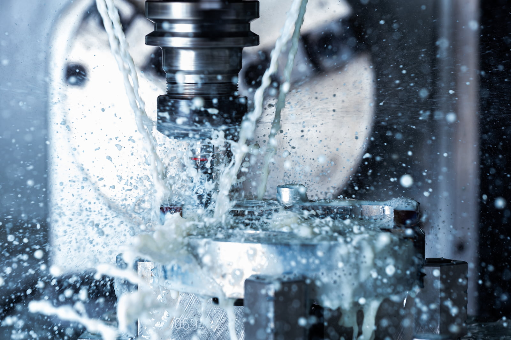

Whether you're new to precision manufacturing or a seasoned pro, understanding the fundamental terms of machining is crucial. From CNC to tolerance and turning to toolpath, this month’s blog by A to Z Machine in Appleton, WI, explores the machining terminology that powers the world of engineering and manufacturing. A to Z Machine CNC Lathe Machinist **Scott Zehner** shares more.

## What are some basic machining operations?

According to Scott, the average day of a machinist involves thinking about and considering at least seven basic machining operations. **Test your skills!** See if you can define the machining terms he highlights in the following list (or ask a colleague if they’re up to the challenge).

1. Milling
2. Turning
3. CNC
4. Tolerance
5. Toolpath
6. Feed Rate
7. Speed (RPM)

Read on for Scott’s definitions and machining knowledge.

## Defining common machining terms

While machining terms are highly technical, Scott, a seasoned machinist, aptly said, "Machinists get to be very creative. **We're like artists making products**. We have to find out our own way to make it and figure out how to make our machine move around to produce it."

These seven technical terms are used by machinists each day:

### Milling

Milling is the process of removing material from a workpiece using a rotating cutting tool called a milling cutter. “The tool spins and the part is stationary, mounted in the machine,” Scott explained. “A mill can make a part in any shape.”

### Turning

Turning is a machining operation where a lathe is used to rotate a workpiece against a cutting tool to shape it. Scott added: “On a lathe, the machine grabs the part and the machine is spinning while the tool is stationary. Lathes primarily make round parts.”

### CNC (Computer Numerical Control)

CNC is a system that uses computer software to control machine tools and automate the machining process. “You give the machine a coordinate and the CNC control will tell the machine to move in that direction,” Scott said. 

### Tolerance

Tolerance is defined as the allowable deviation from a specified dimension in machining, indicating the precision required. Scott elaborated: “Every day, machinists are handed a blueprint. There is a tolerance attached to every part and we’re tasked to hold that tolerance for that part and the customer. We have a calculator on our workbench all day long. We’re constantly doing simple addition and subtraction to bring our parts into tolerance and size.”

### Toolpath

Toolpath means the specific route a cutting tool follows during machining. “We use our CAM software to draw up the part, then we have to draw up a toolpath around that part in order to produce it,” Scott shared. “We try to find our most efficient toolpath in order to reduce waste.”

### Feed Rate & Speed (RPM)

Feed rate (the rate at which the cutting tool advances into the workpiece during machining) and speed (the rotational speed of a cutting tool or workpiece measured in revolutions per minute, or rpm) impact a machinist’s process.

“For harder or more abrasive material, you have to spin slower and adjust how fast the tool or machine is spinning,” Scott said. “**A lot of adjustments are based on visual or audible assessments**. If the machine doesn’t sound like it’s cutting well, chances are it isn’t. When chips are flying, it sounds like popcorn popping. We jokingly call that the sound of money. You don’t want the chips turning into strings of metal, which indicates improper speed.”

## Interested in What A to Z Machinists Can Do for Your Business? 

Our cutting-edge CNC equipment and exceptionally skilled team are prepared to tackle a wide range of machining needs.

<a class="btn btn-primary" href="/contact/">Reach out today!</a>
