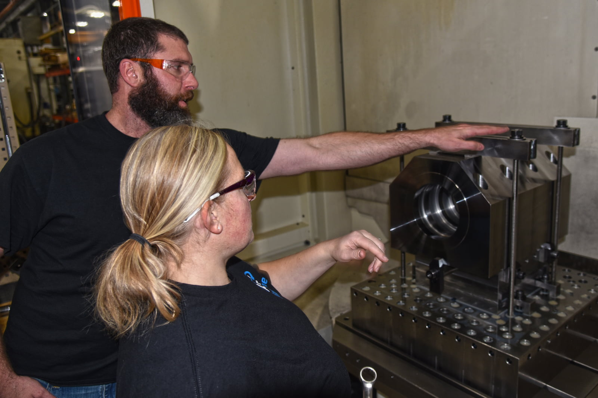

After the original four founding members of A to Z retired and sold the company to employees, the structure of company operations changed. 

“We knew one of the most important things as a company is that we are aligned and that everybody knows the direction that we’re heading,” said A to Z President Don DeWitt. “So many companies will have a mission statement or a vision statement— we decided to go with ‘True North,’ meaning, if you know your True North, you always know the direction that you’re headed.”  

In this month’s blog, Don discusses how and why the company adopted this special philosophy to guide its daily work.  

## How True North began 

As company leaders discussed how to best move forward, A to Z’s board of directors was instrumental in bringing options to the table, including the idea of the “True North” guiding philosophy. Then it was up to company leaders to shape the idea, including the company’s purpose, guiding principles and core values. 

Through the brainstorming process, leaders determined that their purpose is to be the machining industry’s supplier and employer of choice. 

“They have to go together,” DeWitt said. “There’s no way you’re going to be the supplier of choice if you’re not the employer of choice, and vice-versa.” 

From there, leaders adopted a ‘Shingo Model’ journey, “which really clarified for us to how should we be behaving or acting as leaders, and that’s where the guiding principles come into play,” Don said. 

The Shingo Model is essentially a way of building organizational excellence through company culture, a model that originated with Dr. Shigeo Shingo, who worked closely with Toyota executives in Japan. The model’s core focuses on changing behaviors, starting with leadership. “One of the things we say is, we will guide and improve our culture through the way we do our work,” DeWitt said. 

A to Z’s core guiding principles start with ‘Treat Every Individual with Respect’ and ‘Lead with Humility.’ 

## Treating Individuals with Respect 
 
“We take this principle very seriously, and it’s a journey—we have a long way to go, but we try, first and foremost, to treat every individual with respect,” DeWitt said. “And I think the most respectful thing you can do for a person is provide a safe working environment. That’s our highest priority.” 

A to Z leaders want employees to feel that the company cares about them—ensuring there are opportunities for growth no matter what job they’re in, that the work is challenging, that leaders are respectful of them, and that teams are respectful in how they deal with each other. 

“And then there are other things, such do we offer competitive wages, do we offer opportunities for overtime, is our benefits package competitive?” DeWitt said. “And we want to ensure employees have up-to-date equipment so that they can do their job and produce high-quality work on a consistent basis—whether that be in an office setting or on the shop floor.” 

## Leading with Humility 

The second key guiding principle the company has focused on is to lead with humility. “If the way we conduct ourselves is to treat every individual with respect and lead with humility, our culture, our teamwork and our results will improve just by the way we do our work,” DeWitt said. 

Following the principles properly means leaders are creating a willingness to engage, DeWitt said. “If I feel like I’m being treated with respect, if I feel like my leader is leading with humility—or being humble, willing to listen to me, willing to ask questions, willing to take into account my concerns, being respectful with feedback—if I’m having that experience, then I’m most likely to act that way while I’m here, too.” 

## Implementing True North 

A to Z leaders have worked throughout the company to build an understanding of True North and to get leaders aligned with its philosophy, DeWitt says. 

“We start out every significant meeting here at A to Z with a short review of True North,” DeWitt says. “One of the big things that we have worked on is, if you want to make a change in the way the people think of the company or their willingness to engage in the culture, start with the leaders—that will have a significant impact on how, on the culture, and the way their people act.” 

Other guiding principles that are valuable to the company include focusing on the process, embracing continuous improvement, and quality from start to finish. But the company has focused on building the behavioral aspects “because we believe those are the gateway principles to cultural engagement,” DeWitt said. “If people don’t feel respect, you’ll have a very difficult time getting them to engage within the culture.” 

Since the adoption of True North, A to Z has seen improved productivity, but more importantly, “a lot more respectful leadership, employee engagement, and a lot more working across departmental lines to try to solve problems,” DeWitt said.  

## Interested in working with A to Z?      

Learn more about our company and how we live our True North philosophy every day. 

<a class="btn btn--primary" href="/careers/">Apply now!</a>