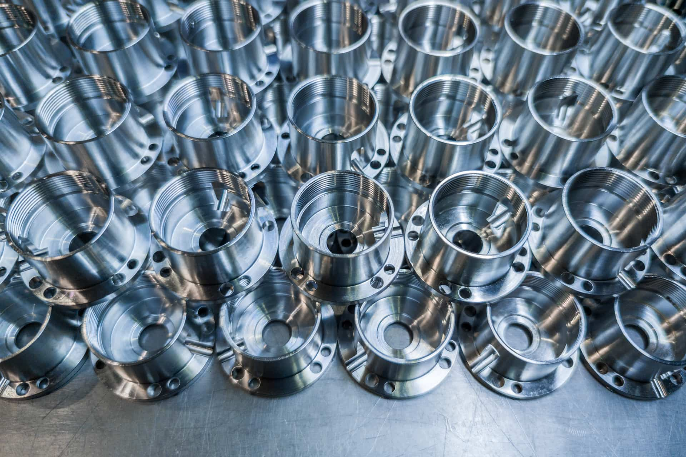

At A to Z Machine, we take great pride in manufacturing high-quality parts for various vital industries. Our components have found their way into diverse sectors such as space exploration, defense operations, food production and product simulation. In this month’s blog, A to Z Customer Service Manager Doug Vannieuwenhoven shares how our parts contribute to the success of these essential industries nationwide.

## Improving safety through the product simulation industry

“One of our main customers is heavy into safety testing and product simulation,” Doug shared, naming NASA and Universal Studios as two of the companies our client serves. “On the vehicle side, they test cars, heavy trucks, motorcycles—basically anything that moves.” 

By simulating how products are used under various conditions, our customer shows companies how to make vehicles safer and determine failure opportunities up front. A to Z Machine parts are instrumental components in the machines used for testing those products. The company also tests architectural designs, including buildings and bridges.

“They can simulate an earthquake and design safer buildings for specific regions of the country,” Doug said. “They even test hip and knee replacement joints to provide data on how long a replacement will last. **It gives you a sense of pride and satisfaction to know the parts machined here are helping make the world a better, safer place**.”

## Supporting defense and military operations

Another vital industry A to Z components support is defense and military. Our parts are trusted by leading defense contractors for their reliability and precision. We adhere to stringent quality standards and maintain strict compliance with defense industry regulations, ensuring that our products meet the most rigorous requirements.

“We meet those requirements through our skilled workforce,” Doug said. “Everyone here collaborates. And we have precision machines, [several certifications and registrations](/blog/machining-certifications/), and adhere to strict quality policies. Our goal is quality from start to finish, and we take that very seriously.”

Specifically, A to Z makes critical parts for the Joint Light Tactical Vehicle (JLTV) used by the military. “We make the mainframes, some steering and other main components to that vehicle,” Doug said. “It was specifically designed to keep our troops safer.”

## How we excel in vital industries

Doug pointed out that A to Z Machine has received numerous accolades to spotlight our continued success in vital industries. We were named Supplier of the Year in 2020 for a prestigious customer, which serves as a testament to our unwavering dedication to quality and customer satisfaction. Plus, our position as a top supplier to a number of other industries underscores the trust placed in us by our valued customers.

## Growth and expansion to continue our mission

Another way A to Z supports vital industries is through growth and expansion efforts. We’re currently constructing a [30,000-square-foot addition](/blog/a-to-z-breaks-ground-on-30000-sq-ft-production-facility/) to our production facility.

“This addition will allow us to move all our production machines into one building to create efficiencies,” Doug said. “The change gives us room to grow and add machines as industries require, meeting the demands of our current and future customers.”

## Looking to build a career with a premier manufacturer?

Our employee-owned company is always hiring dependable, hardworking people. We offer **superior benefits** and [**on-the-job training**](/blog/work-in-machining/). Together, we can drive innovation, efficiency and reliability across vital industries!

<a class="btn btn--primary" href="/careers/">Apply now!</a>