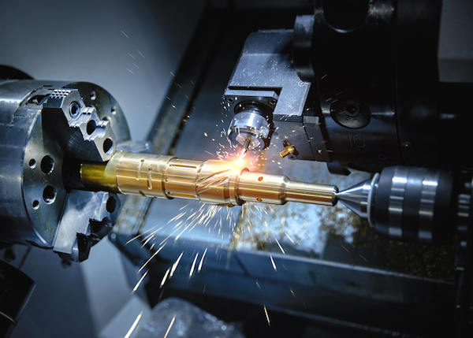

If you're looking for a career that offers **stability, growth and an opportunity to work with your hands**, CNC (computer numerical control) machining could be the perfect fit for you. Machinists at A to Z Machine in Appleton, Wisconsin, use precision tools and machinery to create parts and components for a [wide range of industries](https://www.atozmachine.com/industries/), including agriculture, military, material handling, medical and more.

A to Z Machine Manufacturing Engineering Manager and IT Manager Marc Manteufel shared that he **enjoys the challenge, problem-solving and creativity** of the work.

“There may be a hundred ways to make something, but a machinist gets to decide how it’s done,” Marc said. “The industry is always evolving. There’s always something new to learn.”

Manufacturing Process Manager Al Melby added that machining is a career path that’s always in need. “This is **a skilled trade**,” Al said. “It comes with good pay and benefits in addition to the rewarding work.”

## Is CNC machining a good career?

As manufacturing and production continue to grow and evolve, the demand for skilled machinists is on the rise. In fact, the Bureau of Labor Statistics predicts that employment in this field will grow by 3% between 2020 and 2030.

Marc shared that he went from on-the-job training to where he is today as a manager. “I enjoy machining,” Marc added. “**It’s fun**. I make a good living for myself and my family.”

To Al, machining is **a stable career** that’s always in demand. “There’s always a need for qualified personnel,” Al said. “The machining industry usually seems to weather the storms of economic change better than other industries.”

### What are the day-to-day job duties of a machinist?

While the exact duties of a machinist can vary depending on the employer and industry, in general, Marc and Al said people can expect to:

* Read and interpret technical drawings and blueprints provided by customers
* Set up and operate precision tools and machinery, which usually includes doing some geometry and math
* Run the machine and make the part, paying attention to detail
* Inspect finished parts to ensure they meet quality standards
* Cleanup AKA “teardown the set-up” to prepare the machine for the next person

Materials used in machining range from iron, steel, stainless steel and aluminum to some exotic metals such as titanium.

## What are the benefits of a career in the machining industry?

As a skilled trade, the opportunities for advancement and growth in machining are abundant.

“No matter where you live, there’s machining that needs to be done,” Marc said. “You can probably get a job in a day wherever you are. There’s a **high demand for machinists**.”

Al echoed Marc’s opinion on the stability of the job, adding that machinists are always building their skillset to meet the changing needs of customers. “This is **meaningful work** that offers **lifelong learning opportunities**,” Al said.

## Is it hard to learn CNC machining?

Like any skilled trade, there is a learning curve to becoming a proficient machinist. However, with the right training and experience, anyone can become a successful CNC machinist. A to Z is an employer that offers on-the-job training and apprenticeships to help new machinists develop their skills.

“Machining is definitely **trainable and teachable**,” Marc shared. “We often hire people with little to no experience. If someone has the drive to learn, this is something they can do.”

Al agreed that while machining is a complex career with a lot to learn, it isn’t difficult to do so. “We provide a progressive learning path,” he said. “It’s not an expectation to know everything all at once.”

People who are good in math, pay attention to detail and are good at problem-solving are usually a natural fit as machinists.

### What does it mean to be employee-owned?

A to Z Machine is proud to be an employee-owned business. This means its employees, machinists included, have a direct stake in the success of the company and are motivated to provide the highest quality work and customer service possible.

“People here take more ownership in their daily work and their contribution to the team,” Marc said. “**Being employee-owned drives teamwork** across the company.”

Al agreed: “Everything we do as a team, we’re doing for ourselves. We’re accountable to our team members and ourselves. Being employee-owned has led to **more collaboration**.”

## Ready for a career in machining?

Our employee-owned company is always hiring dependable, hardworking people. We offer **superior benefits** and **on-the-job training**.

<a class="btn btn--primary" href="/careers/">Apply now!</a>