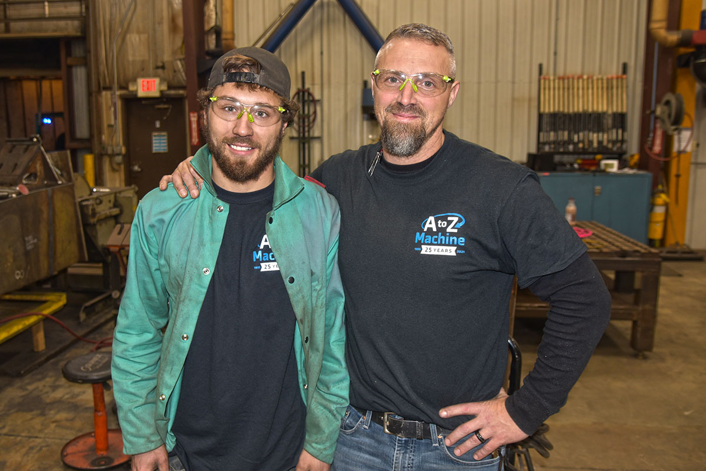

   

As a precision machine shop, A to Z Machine is always working on ways to build its skilled workforce—and one important way it develops those workers is through its Youth Apprenticeship (YA) program. 

“A to Z is probably like most other manufacturing companies or businesses—we’re learning that we have to grow our own,” says Al Melby, Manufacturing Process Manager at A to Z. “We’ve made a strong commitment to the Youth Apprenticeship program.” 

In this month’s blog, Al shares how and why A to Z’s YA Program began, how it trains next-generation skilled workers and how the program has evolved over the years. 

## How A to Z Machine’s YA program works 

Just two short years after A to Z Machine opened in 1996, the company took on its first youth apprentice.  

“And that particular youth apprentice is still employed with us today,” Al says. “He’s been a strong leader and a mentor to others, which some of that I would have to believe came through that apprenticeship.” 

The YA program offers high school students the chance to build skills and explore careers while also allowing employers to develop a workforce that has the abilities that match their needs. 

A to Z works with local high schools and with CESA 6, a nonprofit educational services agency, to facilitate the program. Students earn class credit for participating, and A to Z Machine is accountable for reviewing apprentice performance, meeting standards and reporting back to the schools throughout the school year, Al says. 

## What the YA program does 

Typically, students will come on board at A to Z the summer leading into their senior year, or occasionally their junior year, onboarding after an interview process that determines whether the student is a good cultural fit for the company and the program, Al says. 

Once in the program, the apprentices will have about a 32-hour workweek during the summer. They’ll continue working throughout the school year, arriving early — 6 or 7 a.m. — and work three or four hours in the morning before going to school.  

When a youth apprentice works with A to Z, they’re moved through the different areas of the shop and are paired with various mentors as they learn the trade. They spend time in the tooling and gauging area, which supports the machine shop, or they will work in A to Z’s inspection area, checking the quality of the parts that are made. They also spend time on the shop floor as machinist helpers, as well as in other areas of the company. 

“We make sure we offer pathways to full-time work, with continuing education opportunities,” Al says. “They can come directly to work, or if they want to go on to technical college, we support that pathway, too.” 

Those that choose to go on to school typically continue to work part-time while going to school full- or part-time, Al says. And if a former youth apprentice decides not to go to technical school right away, it’s always an option later down the road. 

The program is open to about three youth apprentices a year. “That being said, we’re always open to expanding that program,” Al says.    

## How A to Z Machine’s Youth Apprenticeship program has grown  

“Our apprenticeship program has grown and evolved since it started—we keep our program fluid in that we look at it each year to see what’s working, what’s not and how we need to make changes,” Al says. “There’s almost always continuous improvement going on.” 

A to Z Machine was recognized in 2022 by the Northeast Wisconsin Manufacturing Alliance with an Excellence in Manufacturing-K12 Partnership Award for its Youth Apprenticeship program.  

“We are employee-owned, so each employee has a vested interest in the success of the youth apprenticeship program,” Al says.  

The success of the YA program is evident, with more than 15 percent of the A to Z manufacturing workforce as current or former youth apprentices. “It’s impressive when you think about it,” Al says. “We currently have three youth apprentices completing their cycle, and all are coming on board full-time this year.” 

## Interested in joining A to Z?      

Join our employee-owned company and become a part of A to Z’s precision team, or learn more about the <a href="https://www.youtube.com/watch?v=_H31Xllc_Co" target="_blank" rel="noopener noreferrer">youth apprenticeship program</a> today!    

<a class="btn btn-primary" href="/careers/">Apply now!</a>
