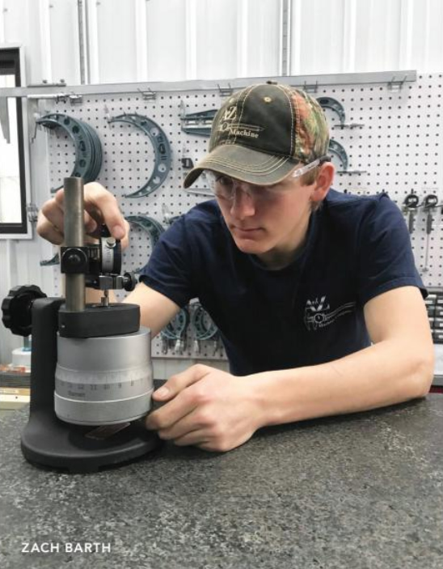

## Zach Barth

### Machinist, Youth Apprentice

Freshman year, Zach Barth was enrolled at Appleton West High School. AFter receiving an invitation from his school principal, he started at Appleton Technical Academy his sophmore year. A-Tech is a charter school for students to gain skills needed for a successful career in advanced manufacturing and industrial technology.

"This was the turning point of my high school career," Zach said. "When the class was introduced to a manual mill, I liked the idea that I could make something that looked professionally made and store-bought."

A-Tech teachers suggested that Zach apply for a manufacturing youth apprenticeship at A to Z Machine. His summer schedule was 6 a.m. to 3 p.m., Monday through Friday. When the school year started, his schedule shortened to 6 a.m. to 10 a.m. After work, Zach goes to school.

"At first, the idea of waking up at 4:30 in the morning was scary. Turns out it was not nearly as bad as I thought. If fact, I have grown to love my schedule," Zach said.

There are two main areas in the shop at A to Z: the tool room and the machine area. Zach currently works in the tool room. Duties include cleaning, calibrating, setting, sending out and retrieving all guaging in the shop. When not setting gauging, he helps co-workers set up and tear down tools for upcoming jobs.

When running machines, Zach's tasks include: machining small parts to specifications using machines such as CNC mills, a manual mill and a manual lathe; measuring and examining completed units in orderto detect defects and ensure consistency; and etching work numbers, dates and other requested text into a finished product.

Both postions require extreme attention to detail, teamwork, communication, determination, mathematics and the willingness to learn.

He advised any young adult or parent to research more about youth apprenticeship programs.

"It was honestly the smartest decision I have made," Zach said. "It is going to be the backbone of my challenging and rewarding, long-term career. The hands-on experience in a real work environment is the greatest learning opportunity one can be offered."
